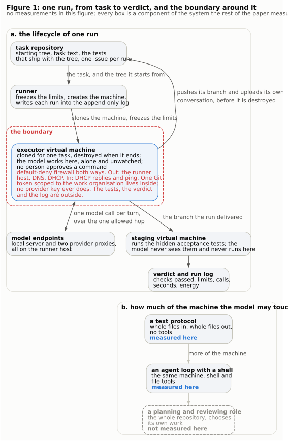
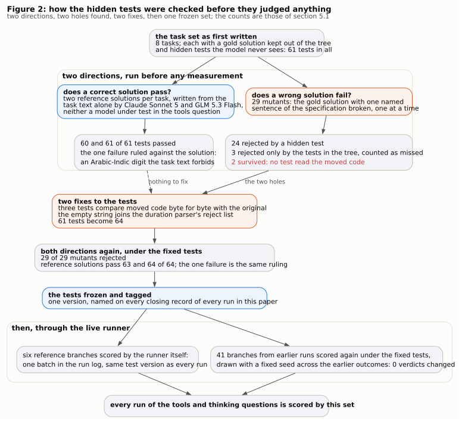
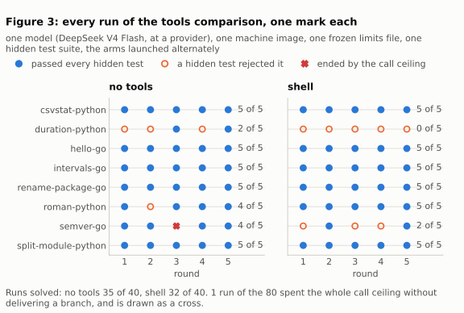
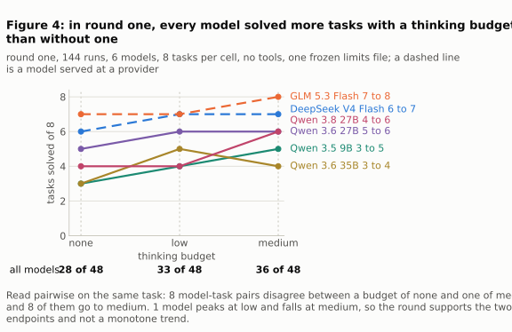
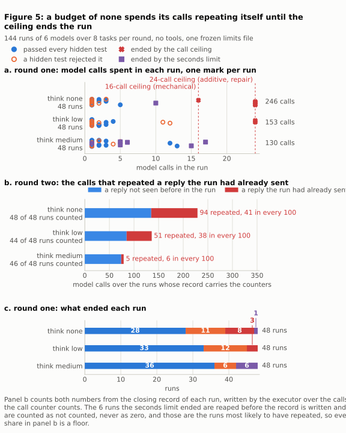
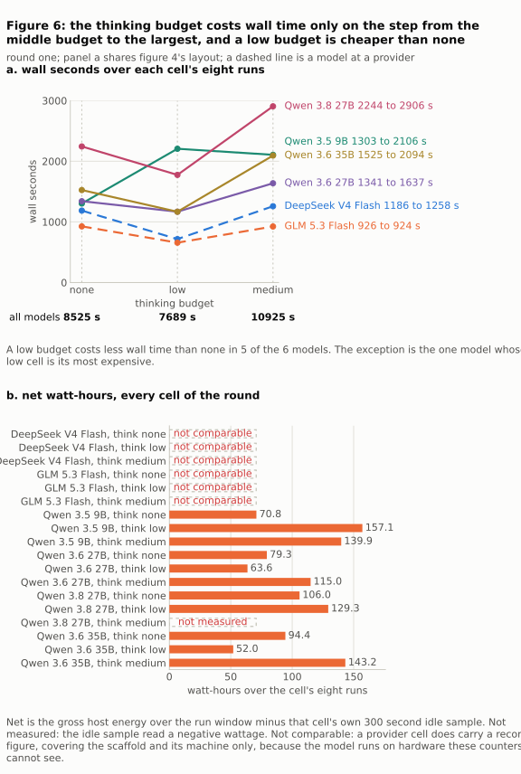
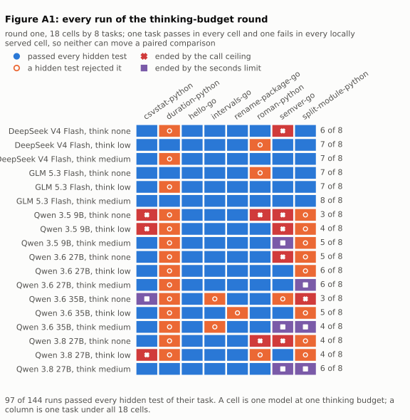
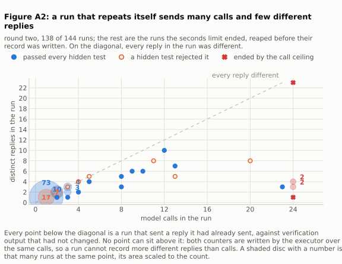
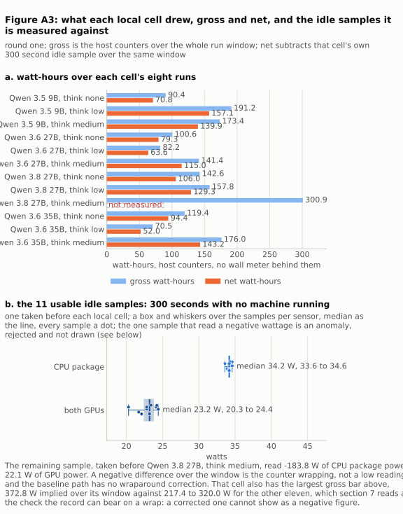
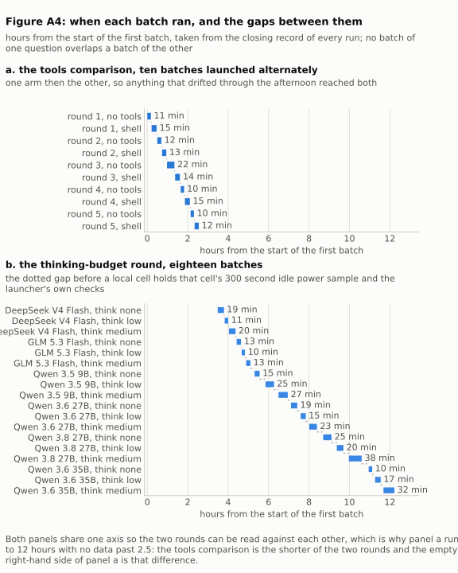

# A model alone in a throwaway machine: how its work was judged, what tools changed, and what more thinking bought

## Abstract

We let a language model write code on its own. It gets a task from a Git repository. It works inside a virtual machine that is created for that one task and deleted when the task ends. Nobody watches it and nobody approves its commands. Tests that the model never sees decide whether the work is correct. This paper measures three things about that setup, on one fixed set of {{num:tasks-in-the-set}} small programming tasks.

A run is one attempt by one model at one task. A run ends in one of three ways: every hidden test passes, a test fails, or a limit stops the run before any test runs. When this paper says a run is solved, it means the first way. Where limits stopped some runs, the count is also given with those runs left out.

**Are the hidden tests right?** Two solutions were written from the task text alone, by models that are not being measured. They pass {{num:sonnet-solution-against-the-amended-judge-checks-passed}} and {{num:glm-solution-against-the-amended-judge-checks-passed}} of the {{num:hidden-checks-over-the-eight-tasks-under-the-amended-judge}} hidden tests. The one failure is a case we ruled on, and section 5.1 shows it. Against the tests as first written, the same two solutions passed {{num:sonnet-reference-checks-passed-of-61}} and {{num:glm-reference-checks-passed-of-61}} of {{num:reference-solutions-checks-run-each}}, and what follows is why the tests changed. We also broke correct solutions on purpose, in {{num:mutants-written}} ways. The tests as first written let {{num:mutants-the-suite-as-written-missed}} of those through. After two fixes they catch all of them. Scoring {{num:branches-scored-again-counted-in-the-ledger-rather-than-in-a-report}} older results again changed {{num:verdicts-that-changed-when-41-branches-were-scored-again}} verdicts.

**Do tools help?** One model ran {{num:runs-per-arm-in-rq2}} runs with no tools, answering each task with whole files, and {{num:runs-per-arm-in-rq2}} runs with a shell and file tools. Without tools it solved {{num:pipeline-runs-solved-of-40}} runs. With tools it solved {{num:session-runs-solved-of-40}}. One no-tools run was stopped by a limit before any test ran, so with that run left out the counts are {{num:pipeline-runs-solved-of-40}} of {{num:pipeline-runs-that-reached-a-check-of-40}} against {{num:session-runs-solved-of-40}} of {{num:session-runs-that-reached-a-check-of-40}}. Paired tests find no difference (p = {{num:exact-two-sided-p-on-the-five-discordant-task-round-pairs-4-against-1}} by run, p = {{num:exact-two-sided-p-for-one-discordant-task}} by task). With tools the model was called {{num:session-model-calls-over-the-40-runs}} times. Without tools, {{num:pipeline-model-calls-over-the-40-runs}} times.

**Does more thinking help?** Six models each ran the same tasks with three thinking budgets: no visible reasoning, {{num:the-middle-thinking-budget-characters-per-call}} characters of it per call, and {{num:the-largest-thinking-budget-run-characters-per-call}} characters. Solved runs rose from {{num:tasks-solved-at-think-none-of-48}} of {{num:runs-per-think-level}} with no reasoning to {{num:tasks-solved-at-think-medium-of-48}} of {{num:runs-per-think-level}} with the largest budget. Leaving out the runs a limit stopped, that is {{num:tasks-solved-at-think-none-of-48}} of {{num:think-none-runs-that-reached-a-check-of-48}} against {{num:tasks-solved-at-think-medium-of-48}} of {{num:think-medium-runs-that-reached-a-check-of-48}}. Every one of the six models improved (sign test p = {{num:sign-test-p-six-of-six-moving-one-way}}). One caution: for the four models we serve ourselves, the no-reasoning setting also changes the chat template, so two things move at once. For the two models at a provider, where only the budget moves, the step is {{num:the-two-models-at-a-provider-tasks-solved-at-think-none-of-16}} to {{num:the-two-models-at-a-provider-tasks-solved-at-think-medium-of-16}} of {{num:the-two-models-at-a-provider-runs-per-budget}}, on {{num:the-two-models-at-a-provider-discordant-pairs-none-against-medium}} pairs that differ, p = {{num:exact-two-sided-p-0-of-2-discordant-pairs-one-way}}. The cost of thinking is wall time, and only on the step from the middle budget to the largest: {{num:think-none-wall-seconds-over-all-six-families}} seconds with no reasoning against {{num:think-medium-wall-seconds-over-all-six-families}} with the largest budget, while the middle budget is cheaper than no reasoning in {{num:families-whose-low-costs-less-wall-time-than-none-of-six}} of the six models. The reason is visible in the record: a model with no reasoning budget tends to send the same reply again and again until the call limit ends the run. In the second round, {{num:round-two-think-none-calls-that-repeated-a-reply-the-run-had-already-sent}} of {{num:round-two-think-none-calls-over-the-runs-carrying-the-counters}} calls with no reasoning repeated an earlier reply, against {{num:round-two-think-medium-calls-that-repeated-a-reply-the-run-had-already-sent}} of {{num:round-two-think-medium-calls-over-the-runs-carrying-the-counters}} with the largest budget.

The thinking-budget result was then run a second time, unchanged. Of the {{num:pairs-of-a-cell-and-a-task-in-each-round}} combinations of a model, a budget and a task, {{num:pairs-that-gave-the-same-verdict-in-both-rounds}} gave the same verdict twice. No model solved fewer tasks with the largest budget than with none, in either round. But the paired comparison came back weaker: {{num:round-two-pairs-the-largest-budget-won-and-the-smallest-lost}} of {{num:round-two-discordant-pairs-none-against-medium}} differing pairs went to the largest budget, p = {{num:round-two-exact-two-sided-p-3-of-11-discordant-pairs}}. Two rounds support the direction, not the sharp form of it that the first round showed.

Every number about tools and thinking is read from an append-only run log, committed with its hash. The numbers about the tests come from working notes, which section 8 names, hashes, and marks as the weakest evidence here.

## 1. Motivation

When people let a capable model work on a real computer, the usual safety measure is approval per command. A rule set sits in front of the tools. It looks at every command the model wants to run, and it allows it, refuses it, or asks a person. That layer is hard to set. Make it strict, and runs stall half way; nothing finishes unless someone is watching. Make it loose, and the model reaches the same end by another route, for example through a shell it was allowed to use. Either way, how a run ends depends on the rule set at least as much as on the model. That is a poor position from which to measure a model.

Isolation is the other answer. Give the model a virtual machine that is created for one task and deleted when the task ends. Let it do what it likes inside. Decide the result with tests that live outside the machine and that the model never sees. Then no single command needs approval, and a run can finish while nobody is watching. That is the design measured here. The question is what the trade costs. What is lost, in tasks actually solved, when the tools are taken away and supervision is replaced by a machine that is thrown away? And what is a model's reasoning worth once the limits it runs under are frozen?



Figure 1 draws one run and the boundary around it. The same mechanism that runs a model unattended in a disposable machine can hold any role, including the planning role that today runs on a real host behind approval per command. Panel b shows an axis: how much of the machine the model may touch. At one end, the model only sends text and gets text back. In the middle, it has a shell and file tools inside the machine. At the far end, it reaches a whole repository and chooses its own work. The two left points are measured here. The third is drawn because it is what the axis is for, and section 7 lists it among the comparisons this paper does not make.

Two of the three questions below have been asked before. Section 6 says by whom, what they found, and where these measurements add a data point rather than an answer.

## 2. Terms, and the design at a glance

Six words are used in a fixed sense. Each is explained here once.

- **cell**: one model at one thinking budget. This is the unit the thinking-budget question varies. Six models at three budgets are {{num:cells-in-the-rq3-round}} cells.
- **batch**: one launch of one cell, or of one arm, over the whole task set. A round is one batch per cell or per arm.
- **arm**: one of the two ways of running the model that the tools question compares: the no-tools arm and the shell arm.
- **scaffold**: the software around the model that turns a task into a delivered branch. It decides what the model is told, what it may call, and what it is shown between calls. The field also calls this a harness, but that word names several different things at once [^macedo2026-harness], so this paper says scaffold.
- **gold solution**: the solution written when the task was written. It ships beside the task, is kept out of the tree the model works in, and is used to show that the tests accept a correct answer.
- **mutant**: a copy of the gold solution with one sentence of the task deliberately broken. The hidden tests should reject it. A mutant a test rejects is said to be killed [^jia2011-mutation].

Every run leaves two rows in one append-only log. The opening record is written when the run is launched and carries the limits it will run under, with their hash. The closing record is written when the verdict is in and carries what the run did and what decided it. Section 8 lists what each field holds.

Four more words are used in their ordinary sense and fixed here so nothing rests on a guess. A **run** is one attempt by one model at one task, and section 4.1 gives its three outcomes. A **reference solution** is a solution written from the task text alone by a model that is not under test; it exists to test the tests, not the model. The **thinking budget** is the cap on how many characters of visible reasoning one call may produce, on one scale for every model [^yang2025-qwen3], in characters per call: {{num:think-level-scale-characters-per-call}}. Only the first three were run: none, {{num:the-middle-thinking-budget-characters-per-call}} and {{num:the-largest-thinking-budget-run-characters-per-call}}. Three budgets make two steps, and the paper names them by their ends: the step from none to the middle budget, and the step from the middle budget to the largest. The largest budget of the scale was left out because it does not fit the time limit on our hardware. That is a decision, not a measurement. The tests that decide a run are called the hidden tests, or the checks, and never a judge: in the current literature a judge is a model that grades output [^zheng2023-judge], which is the opposite of what decides a run here.

| what | this study |
|---|---|
| tasks | {{num:tasks-in-the-set}}, the same for all three questions; by class: {{num:tasks-per-class}} |
| hidden tests over those tasks | {{num:hidden-checks-over-the-eight-tasks-under-the-amended-judge}}, in the fixed set that scored every run here |
| models | {{num:models-in-the-rq3-round}} in the thinking question: {{num:models-served-here}} served on two consumer graphics cards here, {{num:models-served-at-a-provider}} at providers. The tools question uses one provider model in both arms |
| what is varied | tools question: tools or no tools, everything else held. Thinking question: the thinking budget per cell |
| runs | {{num:runs-in-the-rq2-set}} in the tools question, {{num:runs-in-the-rq3-round}} in the thinking question, and {{num:runs-in-rq3-round-two}} more in its second round |
| limits per run | from a file frozen before the round; its name and hash are on every opening record |
| retries | inside a run, the loop may call the model up to {{num:pipeline-most-model-calls-in-one-run}} times on the same task; no run is retried; no person intervenes |
| a person in the loop | none, from launch to verdict |
| record | one append-only log, one opening and one closing row per run, snapshots committed with their hashes |

## 3. The three questions

Each question is stated with what it varies, what it holds fixed, and what counts as its answer. The order is fixed, because each later result counts verdicts that the earlier question validated.

**RQ1. Are the hidden tests right?** The tests decide every verdict in this paper, so a wrong test on one task moves every later count by the same amount, and repeating a round would repeat the error rather than reveal it. The question is answered in both directions: two solutions per task, written from the task text alone by models that are not measured, must pass the tests, and {{num:mutants-written}} solutions that were broken on purpose must fail them. Where the tests were wrong they were fixed before any measurement, and older results were scored again under the fixed tests to show that the fix moved no verdict. The answer is the two counts of section 5.1, the list of what was fixed, and the one ruling made along the way.

**RQ2. Does giving the model a shell and file tools change what gets solved?** One thing varies, the scaffold: the no-tools arm answers each task with whole files, one call at a time, and the shell arm works inside the machine with a shell and file tools. Everything else is held: one model, one machine image, one starting tree, one frozen limits file with one thinking budget per task class, one set of hidden tests. Five rounds of each arm were launched in turns, and the verdicts are compared in pairs, task by task and round by round. The answer is the number of runs and tasks solved in each arm, the paired test on the difference, and what each arm spent in calls, tokens and time to get there.

**RQ3. Does a larger thinking budget buy solved tasks under fixed limits, and what does it cost?** One thing varies, the thinking budget, at the three sizes section 2 gives. Everything else is held: the no-tools arm only, six models, the same tasks, one frozen limits file for every cell, one attempt per run. The {{num:cells-in-the-rq3-round}} cells ran one round each over one night, and then the whole set ran a second time; within each model, the same task at two budgets is one pair, and the pairs are compared. The answer is the solved count per budget, the direction each model moved in, the wall time and energy per budget, and what a run without a budget does with its calls.

Two further questions are designed and not run. **RQ4** would compare isolation against approval per command directly. **RQ5** would vary the shape of the task text. No number in this paper speaks to either.

## 4. Setup

### 4.1 A task, a run, and the three ways a run ends

A task is four things: a starting tree, which is the small repository as the model first sees it, one of two templates, a Go one and a Python one, with the task's own files laid over it; a written specification; the tests that ship with the tree; and a set of hidden tests the model never sees. A run is one attempt by one model at one task, and it ends in exactly one of three ways.

- It **passes** when every hidden test of its task passes. Five of six is not a pass.
- It **fails** when a hidden test fails.
- It is **ended by a limit** when one of the ceilings in section 4.2 stops it before it reaches a test at all. Such a run has no test result.

The solved-task counts in section 5.2 and section 5.3 put a limit-ended run in the not-solved column. That is why every headline count is given twice: once over every run behind it, and once over the runs that reached a test. Nothing in this paper counts a limit-ended run as a pass.

There are {{num:tasks-in-the-set}} tasks. They were chosen by kind and by spread, and they deliberately include tasks no local model had passed and tasks every model had passed. The class decides the limits.

| task | class, and hidden tests when a run reaches them | what it asks for |
|---|---|---|
| csvstat-python | {{num:csvstat-python-class-and-hidden-checks-when-it-reaches-a-verdict}} | a new command-line program over CSV input |
| hello-go | {{num:hello-go-class-and-hidden-checks-when-it-reaches-a-verdict}} | a small new Go program |
| semver-go | {{num:semver-go-class-and-hidden-checks-when-it-reaches-a-verdict}} | new version-comparison code in Go |
| rename-package-go | {{num:rename-package-go-class-and-hidden-checks-when-it-reaches-a-verdict}} | rename a Go package, moving its files with their content unchanged apart from the package line |
| split-module-python | {{num:split-module-python-class-and-hidden-checks-when-it-reaches-a-verdict}} | split a Python module, moving the code unchanged |
| duration-python | {{num:duration-python-class-and-hidden-checks-when-it-reaches-a-verdict}} | fix a duration parser against fixed tests it may not edit |
| intervals-go | {{num:intervals-go-class-and-hidden-checks-when-it-reaches-a-verdict}} | fix interval handling against fixed tests |
| roman-python | {{num:roman-python-class-and-hidden-checks-when-it-reaches-a-verdict}} | fix a Roman-numeral converter against fixed tests |

The class names what the task asks of the model. An **additive** task asks for a new program or new code where none exists. A **repair** task hands over code that fails fixed tests the model may not edit, and asks for the fix. A **mechanical** task asks for a change whose result the specification fixes exactly, moving or renaming code with its content unchanged, so that there is one right answer and the work is in producing it without touching anything else. The nearest everyday term is a refactoring; the class is called mechanical because no design decision is left to the model. The class decides the limits, and section 4.2 says why.

The test counts sum to {{num:hidden-checks-over-the-eight-tasks-under-the-amended-judge}}. One version of the tests scored every run in this paper, and every closing record names it: {{num:closing-records-carrying-the-check-version-both-questions}} records carry that one value. The tests run in their own virtual machine, after the model's machine is gone, against the branch the run delivered. The model is never given them and never runs where they are. Section 9 gives the version string.

### 4.2 The limits

Every run reads its limits from a file that was frozen before the round. The file's name and hash are on every opening record, so a table can be checked against the limits that produced it. The limits depend on the task class and not on the model or the arm, so both sides of every comparison ran under the same ceilings.

| task class | model calls | seconds | reasoning characters |
|---|---|---|---|
| additive | 24 | 900 | 40000 |
| repair | 24 | 900 | 40000 |
| mechanical | 16 | 300 | 10000 |

Those are the thinking question's limits, and the appendix reads the same table off its opening records ({{num:rq3-envelope-per-task-class-calls-seconds-reasoning-characters}}). The mechanical class gets less of everything because its tasks have one right answer and no design in them: the earlier runs the limits were set from finished those tasks in a few calls and well inside the shorter ceiling or not at all, and a shorter ceiling ends a stuck run sooner. Whether the shorter ceiling took anything away is checkable, because a run a limit ends is recorded as such. It ended {{num:runs-the-seconds-limit-ended-on-the-mechanical-limit-of-300-seconds}} of the {{num:mechanical-runs-in-the-rq3-round}} mechanical runs of the thinking question's first round and {{num:round-two-runs-the-seconds-limit-ended-on-the-mechanical-limit-of-300-seconds}} of the second, and the call ceiling {{num:mechanical-runs-the-call-ceiling-ended-in-the-rq3-round}} and {{num:round-two-mechanical-runs-the-call-ceiling-ended}}; every other mechanical run that did not pass failed on the tests. Section 7 keeps the two mechanical tasks as the two that cannot move. The tools question's file carries the same three limits per class and fixes the thinking budget by class instead of by cell, {{num:rq2-thinking-budget-by-task-class}}, the same on both arms; section 5.2 returns to that.

The seconds limit is the one that compares fairly across arms and cells, because a call is not the same size in the two arms. The call ceiling exists to stop a runaway. It was set from earlier measurement so that it binds as rarely as possible: it ended {{num:pipeline-runs-ended-by-the-call-ceiling}} run of {{num:runs-in-the-rq2-set}} in the tools question and {{num:runs-ended-by-the-call-ceiling-all-levels}} of {{num:runs-in-the-rq3-round}} in the thinking question. Every run it ended is counted as not solved, left out of the second denominator, and drawn as its own kind of ending in the figures.

### 4.3 How a thinking budget reaches a model, and how replies are sampled

The thinking budget caps how many characters of visible reasoning one call may produce. For a model we serve ourselves, it is applied as a serving preset, one per budget. The two presets that allow reasoning stop the model at a token budget with a forced stop message. The preset for no reasoning switches thinking off in the chat template. For a model at a provider, the budget is one field of the request. Two caps therefore act on a local model at once: the preset stops it at its token budget, and our runner cuts the stream at the character budget from the frozen file. The paper's scale is the second one. Section 9 gives both preset budgets.

What is counted is the length, in characters, of the reasoning the model returns. If the cut fires, the runner stops reading, marks the reply as cut, and sends one more request with the same conversation and one instruction: here is your reasoning so far, now give the final answer. That counts as one call in the limits and as two requests to the provider. This is budget forcing in its stopping direction [^muennighoff2025-s1].

The runner sends one sampling parameter and no others.

| parameter | value | where it is set |
|---|---|---|
| temperature | 0.2, every model, every call | the runner's model catalogue, sent on each request |
| top-p, top-k, min-p | 0.95, 20, 0.0 on the local models | not sent by the runner; the serving preset's own values |
| repetition penalty | DRY, multiplier 0.8 over the last 64 tokens, on every local preset | the serving preset, in place before these runs |
| seed | not set, and **not recorded** | no seed is sent anywhere |
| the two models at a provider | temperature 0.2; every other sampling parameter is the provider's default and is **not recorded** | the same request body |
| in a run record | **not recorded**: no run record carries any sampling parameter | the opening record carries the limits, the budget and the hashes only |

This matters for the repeated replies in section 5.3. The models were sampling, with temperature and a repetition penalty, not choosing the single most likely token each time. Getting byte-identical replies under sampling is not what a sampler is expected to produce, which is the stronger of the two readings the literature offers [^holtzman2020-degeneration]. These parameters were read from configuration and not from a per-run record, which is weaker evidence than the rest of this paper, and section 7 says so.

### 4.4 The machines, and the boundary around them

Every run gets its own virtual machine, cloned from one template and deleted when the run ends. It is a small machine, four cores and four gigabytes of memory, with the two language toolchains the tasks need. Four of the six models are served on the host that runs the experiments, by a local server that keeps one model loaded at a time across two consumer graphics cards. The other two models are reached through a proxy on the same host. Section 9 gives the sizes, the model builds and the ceilings.

The two provider models are identified in the records by their deployment names and by nothing else. No provider version or model digest is recorded. A silent update at a provider during or between the rounds could not be detected from these records.

Every machine is created with its own firewall: deny everything in both directions, then allow one group. The group allows traffic out to the experiment host, to DNS and to DHCP, and traffic in for DHCP replies and ping. Section 9 lists the rules. Nothing else is reachable, which was checked once from inside a live machine: the Git server and the model gateway answered, and two public package registries timed out.

So the machine is not cut off. It holds one Git token, scoped to the organisation the work goes into, and it uses it: before the machine is deleted, the run pushes its branch and uploads its own conversation to its own issue. It holds no provider key, because the model endpoints sit on the host and need no credential from the machine. The tests, the verdict and the run log are all outside. Because the machine runs code the model wrote, nothing it says is trusted: a verdict counts only when it carries a value the machine never saw, created after the testing machine started.

### 4.5 The loop

The model is given a system prompt that fixes a whole-file reply format, then the task text, the list of files it may edit, and the full text of every source file in the tree. It answers with whole files. The runner writes them into the tree and runs the repository's own verification script.

A second call happens for exactly three reasons and no other.

| what happened on one call | what the model is shown on the next |
|---|---|
| the verification script failed | the last 4000 bytes of its output, and an instruction to send complete corrected files in the same format |
| the reply named a file the task did not allow it to edit | the refused paths |
| the reply contained no file block | that it contained none |

In every case the conversation grows: the model's reply and the new instruction are appended, and nothing is dropped or summarised. A model that sends the same bytes on the next call is doing so against a longer conversation and against verification output that has not changed. The loop stops when the verification script passes and the branch is pushed, when the call ceiling is reached, when the reasoning cap is breached, or on a provider failure.

The prompts are text inside the runner's own script, so there is no separate template file to hash. Section 9 gives that script's hash at each round.

### 4.6 What the energy figures measure

CPU energy is the processor's own energy counter on the virtualisation host, read at the start and at the end of each run window, with a correction if the counter wrapped around. GPU energy comes from the cards' own monitoring tool, sampled once a second, integrated per card and summed. Every closing record names the pair of hosts it sampled and the number of cards; the appendix checks the records against each other rather than printing the names, and finds {{num:distinct-power-sampling-host-pairs-on-the-rq3-records-and-gpu-count}}.

Before each local cell, the runner takes a five-minute idle sample with no machine running. A cell's net figure is its gross figure minus its own idle sample over the same window. {{num:idle-samples-taken-one-before-each-local-cell}} samples were taken and {{num:local-cells-with-a-usable-idle-sample-of-twelve}} are usable; section 7 has the twelfth. The usable ones read between {{num:cpu-package-watts-of-the-eleven-usable-idle-samples-lowest-and-highest}} W on the CPU and between {{num:gpu-watts-of-the-eleven-usable-idle-samples-lowest-and-highest}} W across the two cards. The idle draw is high because the virtualisation host's processor, named in section 9, is a twelve-core part from 2017 whose package alone idles at the {{num:cpu-package-watts-of-the-eleven-usable-idle-samples-lowest-and-highest}} W the samples read, which is why a net figure is reported at all. Board, memory, disks and power-supply loss are not measured. There is no wall meter behind any figure here.

### 4.7 Two kinds of time

Each closing record carries two durations. The first is the machine's own lifetime. It is the shorter one and it is what the seconds limit applies to: all {{num:runs-ended-by-the-seconds-limit-all-levels}} runs that limit ended stopped within {{num:the-largest-overshoot-past-a-class-limit-among-the-runs-the-seconds-limit-ended}} seconds of their class limit. The second is the time from queueing the run to its verdict. It is the larger one, and it is what the cost tables and the energy windows use. It includes creating the issue, booting the machine, deleting it, and booting and running the machine that runs the hidden tests. Over the {{num:runs-in-the-rq3-round}} runs of the thinking question the two sum to {{num:sum-of-the-seconds-field-over-the-rq3-runs}} and {{num:sum-of-the-wall-seconds-field-over-the-rq3-runs}} seconds. The testing machine is the same for every cell, so it adds a constant to every comparison, but it is not model time.

For the two provider models, the second duration also includes network time and any queue or stall at the provider. Nothing timestamps an individual call, so a stall cannot be separated from generation, and a retry after a timeout or a server error leaves no trace either; section 7 lists both among what the record does not carry, and the next round's record should carry them. So the wall-time comparison between a local and a provider model carries an unmeasured provider component. The record does hold a request counter beside the call counter, and section 10 shows what its excess over calls is: the second request that budget forcing sends, and nothing else.

### 4.8 What was held fixed, and the check every batch had to pass

Everything the system would normally decide for itself was pinned, and the pinning is visible in the records. The limits come from a frozen file. The thinking budget is set per cell. Nothing chooses which model tries a task. Nothing moves a failed task to a larger model or a larger budget. Nothing runs a task twice. The test version is tagged and recorded on every closing row. The task list is one committed file. The hosts ran nothing else, and no other work drew on the provider accounts. The experiment host is named on every batch record; the appendix checks the records against each other rather than printing the name, and finds them {{num:distinct-runner-hosts-on-the-rq3-batch-records}}.

Two things moved between rounds and one did not. The runner code differs between the two rounds of the thinking question, and the reason is in section 7: the first round's count of repeated replies had to be rebuilt from uploaded conversations and came out wrong, so the second round's runner writes those counters itself, the ones section 5.3 reads. The same version carries a stall detector written for a later round and switched off for this one. Neither change touches what the model is shown, what it may do, or how a verdict is reached, so the rounds are compared as they stand. Section 9 names both versions. The limits files moved on the host during the tools question's afternoon, but not the file that question was frozen on: all {{num:opening-records-in-the-rq2-set}} of its opening records carry the same file and hash, and so do all the opening records of both thinking rounds. The serving configuration was the same across all three rounds, checked against a backup taken two days before them.

A batch counts only when three records agree. The log: every run has an opening and a closing row, the closing rows cover the whole task list, and every row names the same test version. The summary the runner writes at the end of a batch: it must name the same runs, one delivered branch per delivered row, and complete power rows where power was measured. The Git server: the branches named in the log must exist there. A mismatch stops the launch instead of being noted. The launcher log of the thinking question's first round has {{num:rq3-cells-that-printed-0-mismatch-es}} lines reporting no mismatch, one per batch, and the tools question's log has {{num:rq2-shifts-that-printed-0-mismatch-es}}; {{num:mismatch-lines-in-the-rq3-log-that-were-not-zero}} lines report any. Two further checks guard the record. A new snapshot of the log must contain the previous snapshot as a byte-for-byte prefix, which the appendix re-runs and which passes. And a query over the whole window looks for runs of any other kind inside it and finds none. The prefix check shows the later file extends the earlier one. It does not show that neither was rewritten before it was committed, because the party writing them is the party making the claim. What bears on that is the commit history, which is outside both files.

## 5. Results

### 5.1 The tests reject correct work once, and let wrong work through twice until they were fixed

**Two independently written solutions pass all but one test. {{num:mutants-the-suite-as-written-missed}} of {{num:mutants-written}} deliberately broken copies got through, and both holes are now closed.**



Figure 2 is the shape of this section: the tests were checked in two directions before any measurement, each direction with its own kind of solution, the holes the second direction found were closed, and the fixed set was then frozen and carried through the live runner. The tables below give the counts in the same order.

Two reference solutions were written for each task from the task text alone, in a workspace holding the starting tree and the specification and nothing else. Claude Sonnet 5 wrote one set and GLM 5.3 Flash the other, both at a provider. Neither is the model measured in the tools question: a solution written by the model under test would tune the instrument to that model's habits. Both sets were then scored by the same hidden tests a run is scored by.

| solution written by | tasks | tests run | tests passed | disagreements |
|---|---|---|---|---|
| Claude Sonnet 5 | {{num:sonnet-solution-tasks}} | {{num:reference-solutions-checks-run-each}} | {{num:sonnet-reference-checks-passed-of-61}} | {{num:sonnet-solution-disagreements}} |
| GLM 5.3 Flash | {{num:glm-solution-tasks}} | {{num:reference-solutions-checks-run-each}} | {{num:glm-reference-checks-passed-of-61}} | {{num:glm-solution-disagreements}} |

The one disagreement is on the duration-python task. Its hidden reject test feeds thirteen strings the specification calls invalid and requires every one to be refused. Twelve were refused by both solutions. The thirteenth is an Arabic-Indic digit followed by a unit letter. Python's shorthand digit class matches any Unicode digit, and its integer conversion accepts one, so a pattern written with that class takes the string. The Claude Sonnet 5 solution used that class; the GLM 5.3 Flash solution wrote out the ASCII digits instead. The specification says each part is a non-negative integer in ASCII digits followed by one unit letter, and allows no second reading. So the ruling went against the solution, and nothing in the tests changed.

The other direction is mutation. {{num:mutants-written}} mutants were written over the eight tasks. Each is the task's own gold solution with one named sentence of the specification broken, plus a file quoting the sentence it violates. The gold solution passes every test by construction, so a mutant that survives is a hole in the tests, not a property of the solution. The mutants were written one at a time, each against one named sentence, and not generated by a tool that mutates code systematically, so the table counts what these mutants did. It is not a mutation score of the kind a systematic tool would report.

| stage | mutants | killed by a hidden test | killed only by the tests already in the tree | survived |
|---|---|---|---|---|
| as first run | {{num:mutants-written}} | {{num:mutants-caught-by-a-hidden-check-as-first-run}} | {{num:mutants-caught-only-by-the-tests-in-the-tree-as-first-run}} | {{num:mutants-the-suite-as-written-missed}} |
| after the two fixes | {{num:mutants-written}} | {{num:mutants-caught-by-a-hidden-check-after-the-two-amendments}} | {{num:mutants-killed-only-by-the-tests-in-the-tree-after-the-amendments}} | {{num:mutants-missed-after-the-two-amendments}} |

The two survivors are one sentence twice. The split-module-python specification says the moved helpers arrive with their code unchanged, and the rename-package-go one says the copied files change only in the package line. No hidden test read the moved code at all. What was tested was behaviour, the public interface, and which files exist. A solution that rewrote the body of every function it moved would have been accepted by the tests and refused by the specification. Two fixes followed. The first adds three tests that read the original file from the repository's root commit and compare the moved code against it byte for byte. The second adds the empty string, which the specification names invalid, to the duration-python reject list. With the fixes, the eight tasks carry {{num:hidden-checks-over-the-eight-tasks-under-the-amended-judge}} tests instead of {{num:reference-solutions-checks-run-each}}, and the two reference solutions score {{num:sonnet-solution-against-the-amended-judge-checks-passed-of-checks-run}} and {{num:glm-solution-against-the-amended-judge-checks-passed-of-checks-run}}. The one failure is the same ruled disagreement.

Six of those reference branches were then run through the live runner under the fixed tests, and that exercise is in the run log rather than in a note (the batch section 9 names): one batch of {{num:runs-in-the-rq1-smoke-shift-under-the-amended-judge}} runs over three tasks, carrying the same test version as every other run here. The GLM 5.3 Flash solutions scored {{num:that-batch-the-glm-5-3-flash-reference-solution-checks-passed-of-checks-run-over-its-three-tasks}} tests there and the Claude Sonnet 5 solutions {{num:that-batch-the-claude-sonnet-5-reference-solution-checks-passed-of-checks-run-over-its-three-tasks}}, the one failure again being the ruled disagreement.

**Were the tests stable while the other tables were written?** The tests were edited during the project, and every count in this paper was produced under their final version. What that could hide is a verdict that would have gone the other way under an earlier version. To look for one, branches that earlier runs had delivered were scored again with the tests as they now stand. Only branches whose closing record carried no test version were eligible, because only there could a changed verdict mean the tests moved rather than the work: {{num:branches-eligible-for-re-scoring-from-which-41-were-sampled}} delivered branches. Only the eight tasks of this paper were used. The sample was spread evenly over the earlier outcomes, because a flip can go both ways and a sample of passes could only show one of them. It was drawn with a fixed seed, {{num:the-seed-the-round-zero-sample-was-drawn-with}}: eligible branches are grouped by their earlier outcome, each group is shuffled, and the sample takes one branch from each group in turn. The delivered branches live in an archived, read-only organisation, so each was copied into a fresh one and scored there.

| | count |
|---|---|
| branches attempted | {{num:branches-attempted-for-re-scoring}} |
| branches scored | {{num:branches-scored-again-counted-in-the-ledger-rather-than-in-a-report}} |
| a pass before, a pass again | {{num:of-those-41-the-ones-that-came-back-a-pass}} |
| a test failure before, a test failure again | {{num:of-those-41-the-ones-that-came-back-a-capability-failure}} |
| verdicts that changed | {{num:verdicts-that-changed-when-41-branches-were-scored-again}} |

Not one verdict moved and not one test count moved. The re-scorings are rows in the run log, under the two batches section 9 names, so the two counts come from the log; the report that recorded the exercise gives the same two, {{num:of-the-41-those-the-report-records-as-a-pass-before-and-after}} and {{num:of-the-41-those-the-report-records-as-a-capability-failure-before-and-after}}. The branches that failed to copy did so because of a caching defect in the copying script, which was fixed, and five more branches of one task, {{num:the-second-round-zero-shift-the-task-its-five-branches-belong-to}}, were scored in a second batch; the two batches scored {{num:how-many-branches-each-of-the-two-round-zero-batches-scored}} branches. Those five are inside the total, not beside it. Zero flips is a sample result, not a proof: the rule of three puts a ninety-five per cent upper bound of about {{num:rule-of-three-95-per-cent-upper-bound-on-the-flip-rate-0-of-41}} per cent on the flip rate behind {{num:branches-scored-again-counted-in-the-ledger-rather-than-in-a-report}} branches with none. What it supports is that tables written on different nights can be read against each other. It does not say the tests are correct, and the mutant table says exactly where they were not.

The same two exercises were also run over a chain of six tasks that build one program in six steps: {{num:chain-set-tasks-checks-run-checks-passed-disagreements-per-solution}} for each reference solution, and {{num:chain-set-mutants-mutants-caught-mutants-missed}} for the mutants of that set. That set is not the eight tasks of this paper and no other number here rests on it.

**Where this section's numbers come from.** The reference and mutant exercises were run outside the runner, in workspaces that were not committed, so they produced no row in the run log. What survives them is two reports, which section 8 names and hashes, and the appendix re-derives this section's tables by reading those reports. A passing re-derivation shows that this paper agrees with another document, not that a reader can repeat the measurement. The batch of six reference branches and the re-scorings are the exception: they stand like the rest of the paper.

### 5.2 A shell and file tools changed no verdict this task set can measure, and cost three and a half times the calls

**{{num:pipeline-runs-solved-of-40}} runs solved of {{num:runs-per-arm-in-rq2}} without tools against {{num:session-runs-solved-of-40}} of {{num:runs-per-arm-in-rq2}} with them. No paired test separates them. {{num:session-model-calls-over-the-40-runs}} model calls against {{num:pipeline-model-calls-over-the-40-runs}}.**

One model in both arms, DeepSeek V4 Flash at a provider. Same machine image, same starting tree, same frozen limits, same tests. Five rounds per arm, launched in turns over one afternoon, so anything that drifted during the afternoon reached both arms alike. {{num:shifts-in-the-rq2-set}} batches, {{num:runs-in-the-rq2-set}} runs, each batch checked three ways before the next was launched: {{num:opening-records-in-the-rq2-set}} opening and closing records, no mismatch, all {{num:runs-whose-virtual-machine-was-destroyed-of-80}} machines deleted, the one test version on every row. No run ended for any reason other than a failed test or a spent limit: {{num:rq2-runs-recorded-as-a-structural-failure}} runs are recorded as a failure of the machinery. Figure 3 shows every run; the same counts task by task are a table in section 10.



| | no tools | shell |
|---|---|---|
| runs solved, of {{num:runs-per-arm-in-rq2}} | {{num:pipeline-runs-solved-of-40}} | {{num:session-runs-solved-of-40}} |
| runs solved, of the runs that reached a test | {{num:pipeline-runs-solved-of-40}} of {{num:pipeline-runs-that-reached-a-check-of-40}} | {{num:session-runs-solved-of-40}} of {{num:session-runs-that-reached-a-check-of-40}} |
| tasks solved in at least one of five rounds, of {{num:tasks-in-the-set}} | {{num:pipeline-tasks-solved-in-at-least-one-round-of-8}} | {{num:session-tasks-solved-in-at-least-one-round-of-8}} |

Two ways of scoring that table were tried, and neither separates the arms. Scored by task, a task counts for an arm when the arm solved it in at least one of its five rounds. This is the pass-at-k scoring of the code-generation literature [^chen2021-humaneval], with k equal to the number of rounds. The no-tools arm reaches {{num:pipeline-tasks-solved-in-at-least-one-round-of-8}} of {{num:tasks-in-the-set}} tasks and the shell arm {{num:session-tasks-solved-in-at-least-one-round-of-8}}. One task differs, and the exact two-sided test on differing pairs, which is McNemar's test in its exact form, gives p = {{num:exact-two-sided-p-for-one-discordant-task}}. With one differing task that p is what the scoring produces whichever way the task had gone, so it says more about the scoring than about the arms. Scored by run, round k of one arm is paired with round k of the other, which the alternating launch makes meaningful. Of the {{num:runs-per-arm-in-rq2}} pairs, {{num:the-40-task-round-pairs-solved-by-both-by-neither-by-pipeline-only-by-session-only}} were solved by both, by neither, by the no-tools arm alone and by the shell arm alone, in that order. The exact test on the five that differ gives p = {{num:exact-two-sided-p-on-the-five-discordant-task-round-pairs-4-against-1}}. The result does not depend on which scoring is used.

The one task-level difference is a test ruling and not a tools effect. All {{num:failures-on-duration-python-both-arms-at-5-of-6-checks}} failures on duration-python, in both arms, are the hidden reject test of section 5.1 at five of six: the same Arabic-Indic digit. The no-tools arm passes that test in {{num:duration-python-in-the-no-tools-arm-runs-whose-hidden-reject-check-passed-of-five}} of its five runs, and the three that fail accept {{num:duration-python-in-the-no-tools-arm-strings-the-three-failing-runs-accepted-fewest-and-most}} of the thirteen invalid strings. The semver-go task is where the arms differ most: the shell arm fails it {{num:session-failures-on-semver-go-at-2-of-3-checks}} times of five, at two of three tests. The no-tools arm's single failure there is the one run in eighty that hit the call ceiling, recording {{num:the-one-run-the-call-ceiling-ended-calls-seconds-checks}}. That is the run the second denominator leaves out.

| | no tools | shell |
|---|---|---|
| runs | {{num:runs-per-arm-in-rq2}} | {{num:runs-per-arm-in-rq2}} |
| model calls, total | {{num:pipeline-model-calls-over-the-40-runs}} | {{num:session-model-calls-over-the-40-runs}} |
| model calls per run, median (most) | {{num:pipeline-median-model-calls-per-run}} ({{num:pipeline-most-model-calls-in-one-run}}) | {{num:session-median-model-calls-per-run}} ({{num:session-most-model-calls-in-one-run}}) |
| tool calls per run, median (most) | none, the arm has no tools | {{num:session-median-tool-calls-per-run}} ({{num:session-most-tool-calls-in-one-run}}) |
| tokens in, tokens out, in millions | {{num:pipeline-tokens-in-over-the-40-runs-in-millions-to-two-decimals}}, {{num:pipeline-tokens-out-over-the-40-runs-in-millions-to-two-decimals}} | {{num:session-tokens-in-over-the-40-runs-in-millions-to-two-decimals}}, {{num:session-tokens-out-over-the-40-runs-in-millions-to-two-decimals}} |
| seconds per run, median | {{num:pipeline-median-seconds-per-run}} | {{num:session-median-seconds-per-run}} |
| reasoning characters per run, median (most) | {{num:pipeline-median-reasoning-characters-per-run}} ({{num:pipeline-most-reasoning-characters-in-one-run}}) | {{num:session-median-reasoning-characters-per-run}} ({{num:session-most-reasoning-characters-in-one-run}}) |
| runs ended by the seconds limit | {{num:pipeline-runs-ended-by-the-seconds-limit}} | {{num:session-runs-ended-by-the-seconds-limit}} |
| runs ended by the call ceiling | {{num:pipeline-runs-ended-by-the-call-ceiling}} | {{num:session-runs-ended-by-the-call-ceiling}} |

The reasoning-characters row is not a difference in what the arms were allowed. Both arms ran under one thinking budget per task class, fixed in the frozen file and the same on both sides of every pair: the middle budget of the thinking question, {{num:the-middle-thinking-budget-characters-per-call}} characters per call, on the six additive and repair tasks, and no reasoning on the two mechanical tasks ({{num:rq2-thinking-budget-by-task-class}}). It is a difference in how each arm spent what it was allowed. The no-tools arm answers a whole task in one call and thinks inside that call. The shell arm spends its calls on tool round trips, and within the same cap thought a tenth as much per run. The token counts run the other way, because the no-tools arm pays for the whole tree in its prompt on every call. So the arms differ in reasoning spent as well as in tools, and this design cannot say which of the two a verdict follows; section 7 keeps that, with the round that would separate them.

What this supports, on this task set and this model: there is no task the shell arm ever solved and the no-tools arm never did, and the shell arm spent three and a half times the model calls to reach the same place. Five rounds is enough to say the arms agree on seven of eight tasks. It is not enough to rank them on the eighth, and the arms trade single rounds in both directions: {{num:the-task-round-pairs-that-disagree-and-the-arm-that-won-each}}.

### 5.3 Every model solves more tasks with a thinking budget, and the cost is wall time, only between the middle budget and the largest

**Solved runs rise from {{num:tasks-solved-at-think-none-of-48}} to {{num:tasks-solved-at-think-medium-of-48}} of {{num:runs-per-think-level}} between the smallest and the largest budget, or from {{num:tasks-solved-at-think-none-of-48}} of {{num:think-none-runs-that-reached-a-check-of-48}} to {{num:tasks-solved-at-think-medium-of-48}} of {{num:think-medium-runs-that-reached-a-check-of-48}} over the runs that reached a test. All six models improve. The middle budget costs less wall time than no reasoning at all.**

{{num:cells-in-the-rq3-round}} cells: six models at three thinking budgets, four of the models served here and two at providers. The same eight tasks, one frozen limits file for every cell, nothing choosing which model tries a task, nothing moving a failed task to a larger budget, nothing running a task twice. One round per cell, run unattended over one night. {{num:runs-in-the-rq3-round}} runs, {{num:runs-that-passed}} passed, all {{num:runs-whose-virtual-machine-was-destroyed-of-144}} machines deleted, every cell reporting no mismatch, every row naming the one test version. {{num:round-one-runs-recorded-as-a-structural-failure}} runs are recorded as a failure of the machinery. Every cell is the no-tools arm, so nothing in this section is a claim about tools.



| model | none | low | medium |
|---|---|---|---|
| DeepSeek V4 Flash, at a provider | {{num:deepseek-v4-flash-cloud-at-think-none-tasks-solved-of-8}} | {{num:deepseek-v4-flash-cloud-at-think-low-tasks-solved-of-8}} | {{num:deepseek-v4-flash-cloud-at-think-medium-tasks-solved-of-8}} |
| GLM 5.3 Flash, at a provider | {{num:glm-5-3-flash-cloud-at-think-none-tasks-solved-of-8}} | {{num:glm-5-3-flash-cloud-at-think-low-tasks-solved-of-8}} | {{num:glm-5-3-flash-cloud-at-think-medium-tasks-solved-of-8}} |
| Qwen 3.5 9B | {{num:my-qwen-3-5-9b-at-think-none-tasks-solved-of-8}} | {{num:my-qwen-3-5-9b-at-think-low-tasks-solved-of-8}} | {{num:my-qwen-3-5-9b-at-think-medium-tasks-solved-of-8}} |
| Qwen 3.6 27B | {{num:my-qwen-3-6-27b-at-think-none-tasks-solved-of-8}} | {{num:my-qwen-3-6-27b-at-think-low-tasks-solved-of-8}} | {{num:my-qwen-3-6-27b-at-think-medium-tasks-solved-of-8}} |
| Qwen 3.8 27B | {{num:my-qwen-3-8-27b-at-think-none-tasks-solved-of-8}} | {{num:my-qwen-3-8-27b-at-think-low-tasks-solved-of-8}} | {{num:my-qwen-3-8-27b-at-think-medium-tasks-solved-of-8}} |
| Qwen 3.6 35B | {{num:my-qwen-3-6-35b-at-think-none-tasks-solved-of-8}} | {{num:my-qwen-3-6-35b-at-think-low-tasks-solved-of-8}} | {{num:my-qwen-3-6-35b-at-think-medium-tasks-solved-of-8}} |
| **all six, of {{num:runs-per-think-level}} runs** | **{{num:tasks-solved-at-think-none-of-48}}** | **{{num:tasks-solved-at-think-low-of-48}}** | **{{num:tasks-solved-at-think-medium-of-48}}** |
| **all six, of the runs that reached a test** | **{{num:tasks-solved-at-think-none-of-48}} of {{num:think-none-runs-that-reached-a-check-of-48}}** | **{{num:tasks-solved-at-think-low-of-48}} of {{num:think-low-runs-that-reached-a-check-of-48}}** | **{{num:tasks-solved-at-think-medium-of-48}} of {{num:think-medium-runs-that-reached-a-check-of-48}}** |

The next table reads the same outcomes in pairs. A pair is one model and one task at two budgets. It differs when one budget solved the task and the other did not, and only differing pairs carry information; the exact test asks whether the differing pairs lean one way more than chance would give.

| comparison | pairs won only by the first, then only by the second | differing pairs | two-sided exact p |
|---|---|---|---|
| none against low | {{num:none-against-low-pairs-won-only-by-none-then-only-by-low}} | {{num:discordant-pairs-none-against-low}} | {{num:exact-two-sided-p-4-of-13-discordant-pairs}} |
| low against medium | {{num:low-against-medium-pairs-won-only-by-low-then-only-by-medium}} | {{num:discordant-pairs-low-against-medium}} | {{num:exact-two-sided-p-4-of-11-discordant-pairs}} |
| **none against medium** | **{{num:none-against-medium-pairs-won-only-by-none-then-only-by-medium}}** | **{{num:discordant-pairs-none-against-medium}}** | **{{num:exact-two-sided-p-0-of-8-discordant-pairs-one-way}}** |

The design is paired: each model faces the same eight tasks at all three budgets, so the totals understate what the data can say. Read pair by pair, there is not one task, in any model, that was solved with no reasoning and failed with the largest budget. Neither single step reaches a p below five per cent on its own, so the claim is about the two ends of the scale, and it would be wrong to quote either half as a result. The last row of the model table is the exception the direction has to carry: Qwen 3.6 35B peaks at the middle budget and falls at the largest, which is the shape the literature reports for tasks where extra reasoning stops paying [^wani2026-reasoning-tax]. Each side of each pair is one run. Had one of the eight differing pairs gone the other way, the exact two-sided p would be {{num:exact-two-sided-p-had-one-of-the-eight-discordant-pairs-gone-the-other-way}} instead of {{num:exact-two-sided-p-0-of-8-discordant-pairs-one-way}}.

**For four of the six models, the budget is not the only thing that moved.** Section 4.3 says how a budget reaches a model. For a model served here, the cell with no reasoning runs a second deployment with thinking switched off in the chat template, while the other two budgets run the first deployment. Those four models supply {{num:outcomes-at-each-budget-that-come-from-the-four-locally-served-models}} of the {{num:runs-per-think-level}} outcomes at each budget, so most of the table above compares a budget and a template at once. For the two models at a provider, the budget is one field of the same request and nothing else differs. There the same step goes from {{num:the-two-models-at-a-provider-tasks-solved-at-think-none-of-16}} of {{num:the-two-models-at-a-provider-runs-per-budget}} with no reasoning, over the {{num:the-two-models-at-a-provider-runs-that-reached-a-check-at-think-none-of-16}} of those runs that reached a test, to {{num:the-two-models-at-a-provider-tasks-solved-at-think-low-of-16}} at the middle budget and {{num:the-two-models-at-a-provider-tasks-solved-at-think-medium-of-16}} at the largest. Between the ends, {{num:the-two-models-at-a-provider-discordant-pairs-none-against-medium}} pairs differ, {{num:the-two-models-at-a-provider-none-against-medium-pairs-won-only-by-none-then-only-by-medium}} of them to no reasoning and to the largest budget in that order, p = {{num:exact-two-sided-p-0-of-2-discordant-pairs-one-way}}. That subset moves the same way and cannot decide the question on its own: two differing pairs cannot reach five per cent whichever way they land. Section 7 keeps this.

The pairwise test treats the pairs as independent, which they are not, since the same task recurs across models. The cautious reading throws the sizes away and asks only which way each model moved: all {{num:families-improving-from-none-to-medium-of-six}} of six improve from the smallest budget to the largest, and a two-sided sign test on six of six gives p = {{num:sign-test-p-six-of-six-moving-one-way}}. Both readings are computed from the same {{num:runs-per-think-level}} outcomes, so their agreement shows the first does not depend on treating correlated pairs as independent. It adds no new evidence.

**The same result, seen from the other side.** A model with no reasoning budget does not spend its calls on nothing. The table below is from the second round of the same eighteen cells, not the first, because the second round's closing records carry counters the runner wrote itself over the same calls it counted. Section 7 says why the first round's figures for this are not quoted.



| thinking budget | runs counted | calls | distinct replies | repeated | share of those calls repeated |
|---|---|---|---|---|---|
| none | {{num:round-two-think-none-runs-carrying-the-reply-counters-of-48}} of {{num:round-two-runs-per-think-level}} | {{num:round-two-think-none-calls-over-the-runs-carrying-the-counters}} | {{num:round-two-think-none-distinct-replies-over-those-runs}} | {{num:round-two-think-none-calls-that-repeated-a-reply-the-run-had-already-sent}} | {{num:round-two-think-none-per-cent-of-those-calls-that-repeated-a-reply}} per cent |
| low | {{num:round-two-think-low-runs-carrying-the-reply-counters-of-48}} of {{num:round-two-runs-per-think-level}} | {{num:round-two-think-low-calls-over-the-runs-carrying-the-counters}} | {{num:round-two-think-low-distinct-replies-over-those-runs}} | {{num:round-two-think-low-calls-that-repeated-a-reply-the-run-had-already-sent}} | {{num:round-two-think-low-per-cent-of-those-calls-that-repeated-a-reply}} per cent |
| medium | {{num:round-two-think-medium-runs-carrying-the-reply-counters-of-48}} of {{num:round-two-runs-per-think-level}} | {{num:round-two-think-medium-calls-over-the-runs-carrying-the-counters}} | {{num:round-two-think-medium-distinct-replies-over-those-runs}} | {{num:round-two-think-medium-calls-that-repeated-a-reply-the-run-had-already-sent}} | {{num:round-two-think-medium-per-cent-of-those-calls-that-repeated-a-reply}} per cent |

In the first round, total calls fall as the budget rises: {{num:think-none-model-calls-over-the-48-runs}}, {{num:think-low-model-calls-over-the-48-runs}} and {{num:think-medium-model-calls-over-the-48-runs}} over the {{num:runs-per-think-level}} runs of each budget. The call ceiling ended {{num:runs-ended-by-the-call-ceiling-at-think-none}} runs with no reasoning, {{num:runs-ended-by-the-call-ceiling-at-think-low}} at the middle budget and {{num:runs-ended-by-the-call-ceiling-at-think-medium}} at the largest, while the seconds limit ended {{num:runs-ended-by-the-seconds-limit-at-think-none}}, {{num:runs-ended-by-the-seconds-limit-at-think-low}} and {{num:runs-ended-by-the-seconds-limit-at-think-medium}}. A run the seconds limit ends stops making calls, so part of the fall in calls is that and not only less looping. Leaving out every run the seconds limit ended gives {{num:think-none-calls-per-run-over-the-runs-the-seconds-limit-did-not-end}} calls per run with no reasoning over {{num:think-none-runs-the-seconds-limit-did-not-end-of-48}} runs, {{num:think-low-calls-per-run-over-the-runs-the-seconds-limit-did-not-end}} over {{num:think-low-runs-the-seconds-limit-did-not-end-of-48}}, and {{num:think-medium-calls-per-run-over-the-runs-the-seconds-limit-did-not-end}} over {{num:think-medium-runs-the-seconds-limit-did-not-end-of-48}}. The direction survives that correction, which is why it is quoted.

What the calls went on is counted, not guessed. As a run ends, the runner writes two numbers into its closing record: how many calls it made, and how many of those repeated a reply the run had already sent. Both count the same calls, so the ratio is a share of calls. {{num:round-two-runs-carrying-the-reply-counters-of-144}} of the second round's {{num:runs-in-rq3-round-two}} runs carry them. The rest are the runs the seconds limit ended, whose machine is deleted before the record is written; they are counted as not counted, not as zero. Those are the runs that ran longest, and so the runs most likely to have been repeating, which makes every share in the table a floor and not an estimate. The step from no reasoning to the middle budget, {{num:round-two-think-none-per-cent-of-those-calls-that-repeated-a-reply}} per cent of {{num:round-two-think-none-calls-over-the-runs-carrying-the-counters}} calls to {{num:round-two-think-low-per-cent-of-those-calls-that-repeated-a-reply}} per cent of {{num:round-two-think-low-calls-over-the-runs-carrying-the-counters}}, rests on the complete set of runs with no reasoning.

So the two results are one mechanism seen twice. A run with no reasoning budget gets stuck: it sends a byte-identical reply against verification output that has not changed, until the ceiling ends it. The conversation it answers is not identical each time, because each failed call appends the reply and the new verification output; the model is stuck against the feedback, not against the prompt. One run of the second round spent its whole call ceiling on {{num:round-two-fewest-distinct-replies-in-a-run-that-spent-the-whole-24-call-ceiling}} distinct reply. Two other explanations were checked. Could the runner have failed to parse what the model sent? The first round's conversations were read for the {{num:my-qwen-3-5-9b-runs-that-spent-the-whole-24-call-ceiling}} Qwen 3.5 9B runs that spent the whole ceiling, and every reply carried a readable file block. That count comes from the conversations on the issues and is recorded in a working note, not in a file committed with this paper, and it is not claimed for the other ceiling-ended runs. Could a malformed tool call be the cause? This arm has no tool-calling interface at all, so no.

**What it costs.** Not calls, which fall as the budget rises. Wall time, and only on the step from the middle budget to the largest.



Wall seconds per cell, summed over its eight runs, from queueing a run to its verdict (section 4.7):

| model | none (sec) | low (sec) | medium (sec) |
|---|---|---|---|
| DeepSeek V4 Flash, at a provider | {{num:deepseek-v4-flash-cloud-at-think-none-wall-seconds-over-its-eight-runs}} | {{num:deepseek-v4-flash-cloud-at-think-low-wall-seconds-over-its-eight-runs}} | {{num:deepseek-v4-flash-cloud-at-think-medium-wall-seconds-over-its-eight-runs}} |
| GLM 5.3 Flash, at a provider | {{num:glm-5-3-flash-cloud-at-think-none-wall-seconds-over-its-eight-runs}} | {{num:glm-5-3-flash-cloud-at-think-low-wall-seconds-over-its-eight-runs}} | {{num:glm-5-3-flash-cloud-at-think-medium-wall-seconds-over-its-eight-runs}} |
| Qwen 3.5 9B | {{num:my-qwen-3-5-9b-at-think-none-wall-seconds-over-its-eight-runs}} | {{num:my-qwen-3-5-9b-at-think-low-wall-seconds-over-its-eight-runs}} | {{num:my-qwen-3-5-9b-at-think-medium-wall-seconds-over-its-eight-runs}} |
| Qwen 3.6 27B | {{num:my-qwen-3-6-27b-at-think-none-wall-seconds-over-its-eight-runs}} | {{num:my-qwen-3-6-27b-at-think-low-wall-seconds-over-its-eight-runs}} | {{num:my-qwen-3-6-27b-at-think-medium-wall-seconds-over-its-eight-runs}} |
| Qwen 3.6 35B | {{num:my-qwen-3-6-35b-at-think-none-wall-seconds-over-its-eight-runs}} | {{num:my-qwen-3-6-35b-at-think-low-wall-seconds-over-its-eight-runs}} | {{num:my-qwen-3-6-35b-at-think-medium-wall-seconds-over-its-eight-runs}} |
| Qwen 3.8 27B | {{num:my-qwen-3-8-27b-at-think-none-wall-seconds-over-its-eight-runs}} | {{num:my-qwen-3-8-27b-at-think-low-wall-seconds-over-its-eight-runs}} | {{num:my-qwen-3-8-27b-at-think-medium-wall-seconds-over-its-eight-runs}} |
| **all six** | **{{num:think-none-wall-seconds-over-all-six-families}}** | **{{num:think-low-wall-seconds-over-all-six-families}}** | **{{num:think-medium-wall-seconds-over-all-six-families}}** |

The step that costs is the one from the middle budget to the largest, and {{num:families-whose-medium-costs-more-wall-time-than-none-of-six}} of the six models rise across it. The step to the middle budget runs the other way in {{num:families-whose-low-costs-less-wall-time-than-none-of-six}} of the six, which is what the repeated replies explain: a run that cannot think spends its wall time re-sending replies until the ceiling stops it, and that costs more time than thinking once. The exception is Qwen 3.5 9B, whose middle budget is its most expensive cell; it is also the model that spent the whole call ceiling most often, and one round cannot say whether those are the same fact. Energy is measured only where the model runs on hardware these counters can see. All twelve local cells have a gross figure and {{num:local-cells-with-a-usable-idle-sample-of-twelve}} of them a net one. The six provider cells carry a figure too, but it covers the scaffold and its machine while the model runs elsewhere, so it is not comparable with a local cell and is not drawn beside one.

### 5.4 The thinking result run a second time: the direction repeats, the sharpness does not

**The same eighteen cells ran again. {{num:pairs-that-gave-the-same-verdict-in-both-rounds}} of the {{num:pairs-of-a-cell-and-a-task-in-each-round}} combinations of a cell and a task gave the same verdict twice. The comparison between the smallest and largest budget comes back in the same direction, and no longer below five per cent.**

The round ran over one afternoon and evening, on the same tasks, with the same limits file and hash on all {{num:opening-records-of-round-two-all-carrying-that-one-file-and-hash}} opening records and the same test version on every closing one. A cell's batch id ends in the same model and budget suffix in both rounds, and all {{num:cells-of-round-two-whose-batch-id-ends-in-the-same-suffix-as-round-one-s-of-eighteen}} match, which is what makes a cell of one round the same cell in the other. The runner code does not match: section 9 names both versions, and the later one adds the reply counters read above and a stall detector that was switched off. The three-way check of section 4.8 passed for every batch, {{num:round-two-cells-that-printed-0-mismatch-es}} of them reporting no mismatch and {{num:mismatch-lines-in-the-round-two-log-that-were-not-zero}} reporting one, and the window query found {{num:runs-of-any-other-kind-inside-the-round-two-window}} runs of any other kind inside the round. Of {{num:runs-in-rq3-round-two}} runs, {{num:runs-that-passed-in-round-two-of-144}} passed, against {{num:runs-that-passed}} in the first round.

**What moved.** {{num:cells-whose-pass-count-moved-between-the-rounds-of-eighteen}} of the {{num:cells-in-rq3-round-two}} cells changed their pass count, {{num:cells-that-passed-more-tasks-in-round-two}} of them upward and {{num:cells-that-passed-fewer-tasks-in-round-two}} downward, and no cell moved by more than {{num:the-largest-move-by-any-cell-between-the-rounds-in-tasks}} tasks. At the level of pairs, {{num:pairs-that-failed-in-round-one-and-passed-in-round-two}} pairs passed only in the second round and {{num:pairs-that-passed-in-round-one-and-failed-in-round-two}} only in the first, {{num:pairs-that-flipped-between-the-rounds-either-way}} in all. Two observations of a pair give that count and nothing more: no rate, no interval and no effect size is computed from it.

**What the second round does to section 5.3.** Solved runs per budget are {{num:round-two-tasks-solved-at-think-none-of-48}}, {{num:round-two-tasks-solved-at-think-low-of-48}} and {{num:round-two-tasks-solved-at-think-medium-of-48}} of {{num:round-two-runs-per-think-level}}, against {{num:tasks-solved-at-think-none-of-48}}, {{num:tasks-solved-at-think-low-of-48}} and {{num:tasks-solved-at-think-medium-of-48}} in the first round. {{num:round-two-models-solving-more-from-none-to-medium-of-six}} of the six models solve more tasks at the largest budget than with none and {{num:round-two-models-solving-fewer-from-none-to-medium-of-six}} solve fewer, so no model contradicts the direction in either round. But the two that are level make the cautious test weaker: a sign test on the models that moved gives p = {{num:round-two-sign-test-p-on-the-four-models-that-moved-from-none-to-medium}} where the first round gave {{num:sign-test-p-six-of-six-moving-one-way}}. Read pair by pair, {{num:round-two-discordant-pairs-none-against-medium}} pairs differ between the two ends of the scale, {{num:round-two-pairs-the-largest-budget-won-and-the-smallest-lost}} of them going to the largest budget and {{num:round-two-pairs-the-smallest-budget-won-and-the-largest-lost}} to none, p = {{num:round-two-exact-two-sided-p-3-of-11-discordant-pairs}}. The first round had {{num:discordant-pairs-none-against-medium}} differing pairs, all of them to the largest budget, at p = {{num:exact-two-sided-p-0-of-8-discordant-pairs-one-way}}. The sentence of section 5.3 that the second round takes away is that one: that no task, in any model, was solved with no reasoning and failed with the largest budget. What is left is the same sign in both rounds, and a p below five per cent in one of them.

**The mechanism.** The repeated-reply table of section 5.3 is this round's, so it is not repeated here. What the second round adds is how often the ceiling was reached at all: it ended {{num:round-two-runs-ended-by-the-call-ceiling}} runs against {{num:runs-ended-by-the-call-ceiling-all-levels}} in the first round, and {{num:round-two-runs-ended-by-the-call-ceiling-at-think-medium}} at the largest budget in both.

**What the limits took out.** The seconds limit ended {{num:round-two-runs-ended-by-the-seconds-limit}} runs against {{num:runs-ended-by-the-seconds-limit-all-levels}} in the first round, {{num:round-two-runs-the-seconds-limit-ended-on-the-mechanical-limit-of-300-seconds}} of them on the shorter limit the mechanical class carries, and those runs have no reasoning-character count, which section 7 keeps. One further run is recorded as a failure of the machinery: the model endpoint refused a request larger than the context it was serving. The first round had {{num:round-one-runs-recorded-as-a-structural-failure}} of those. It counts as not solved, and the pair it belongs to failed in both rounds, so it flipped nothing. Two of the round's idle power samples came back impossible in the way section 7 describes, leaving {{num:round-two-local-cells-with-a-usable-idle-sample-of-twelve}} of the twelve local cells with a net energy figure, against {{num:local-cells-with-a-usable-idle-sample-of-twelve}} in the first round.

Two rounds are two observations. They give the counts above. They do not give the variance, the interval or the effect size that section 7 says one round cannot give. What they add is that the direction survived being asked twice, and that its sharpest form did not. The round is reported cell by cell in a note committed beside this paper, which section 9 names, and every number in that note is a row of the same appendix.

This is a first calibration of the instrument, not a finished measurement. The second round already changed what the runner records, and section 7 ends with the list of what the next round changes. A round costs one night or one afternoon of an otherwise idle host, so the questions are cheap to ask again with those additions, and the paper's claim is the direction and the mechanism, not the size.

## 6. Relation to prior work

**What is already established.**

1. Weak acceptance tests dominate verdicts on coding benchmarks. On SWE-bench, "31.08% of the passed patches are suspicious patches due to weak test cases" [^aleithan2024-swebench-plus]. A differential study finds weaknesses "which causes 7.8% of all patches to count as correct while failing the developer-written test suite" [^wang2025-solved-correctly]. Strengthening the suites adversarially shows "one in five 'solved' patches from the top-30 agents are semantically incorrect" [^yu2026-swe-abs]. That is the whole reason RQ1 exists.
2. Strengthening a test suite with deliberately broken variants of a known-good solution is the standard method and not an invention here: mutation adequacy [^jia2011-mutation], applied at benchmark scale [^yu2026-swe-abs]. Section 5.1 is that method on a set of {{num:hidden-checks-over-the-eight-tasks-under-the-amended-judge}} tests with {{num:mutants-written}} mutants written one at a time against the specification, run before any measurement.
3. A fixed pipeline with no agency is competitive with an agentic scaffold at lower cost [^xia2024-agentless], and the resource side of that trade has been measured, finding that effectiveness turns on how a scaffold and its base model fit together [^fan2025-swe-effi]. RQ2's no-tools arm is a whole-file text protocol with a verification loop, in the spirit of that pipeline rather than an implementation of it.
4. Reasoning effort buys accuracy and the relation is not monotone: test-time compute scaling [^snell2024-test-time], explicit thinking budgets in hybrid open models [^yang2025-qwen3], budget forcing [^muennighoff2025-s1], and a measurement across task types reporting "systematic diminishing returns at higher reasoning effort levels, including cases where additional thinking reduces accuracy" [^wani2026-reasoning-tax]. RQ3's direction replicates the first, and its one non-monotone model is the shape the last describes.
5. Repetition until termination is a documented failure of decoding [^holtzman2020-degeneration], reported in production code workloads as a self-reinforcing loop whose root cause is located in greedy decoding [^wang2025-repetition-production].
6. The energy of locally served models, reasoning ones included, is measured territory: latency, power and energy per token on edge GPUs [^kubwimana2025-edgereasoning], and energy against task resolution for four agentic frameworks driven by small local models [^tripathy2025-swenergy]. Nothing in section 5.3 opens that ground.

**What looks less examined, with the check that would falsify each.**

1. Cost curves at the level of verdicts, per thinking budget: solved coding tasks under hidden tests, measured together with wall time and host energy, per budget, on one frozen unattended pipeline. The check was to read the energy work closely for end-to-end task success against energy on coding workloads. It fired: energy against resolution rate across frameworks with small local models is exactly what one of them measures [^tripathy2025-swenergy]. What is left is narrow and is stated as such: that work varies the framework and not the thinking budget, and its resolution rates are near zero, so this round adds a reasoning-effort axis and non-zero solve rates to the same picture.
2. The inversion in wall time, and its mechanism: a middle thinking budget costing less end-to-end wall time than none, in {{num:families-whose-low-costs-less-wall-time-than-none-of-six}} of six models, because runs without reasoning re-send byte-identical replies against verification feedback until the call ceiling ends them. The check had two halves. In the literature searched, nothing reports that inversion; the nearest work routes between a thinking and a non-thinking mode and reports the expected direction, not thinking being faster [^synapseroute2025]. Absence in four searches is weak evidence and is not offered as more. The second half was to confirm the mechanism once the sampling parameters were known: they are, in section 4.3, and the replies were byte-identical under sampling and not under greedy decoding, which is the reading the classic account of the loop does not cover [^wang2025-repetition-production]. If a later search finds the inversion reported, the claim becomes a replication of it on small local models.
3. A frozen single-variable comparison of two scaffolds at small-model scale: one model, one image, one limits file, one set of hidden tests, alternating launches. This is a methods point and not a headline. It neither confirms nor contradicts the cited comparisons, which use frontier models on a benchmark of real repository issues [^xia2024-agentless] [^fan2025-swe-effi]; {{num:runs-in-the-rq2-set}} runs of one small provider model on {{num:tasks-in-the-set}} tasks add one clean data point and nothing more.

## 7. Threats and limits

**Isolation is this paper's premise, and this paper does not test it.** No escape was attempted, no egress was checked from inside a scored run, and no audit of the machines is reported. Section 4.4 describes the rules as written and one probe of one live machine; that is a statement about configuration, not a security result. What the records carry is narrower: every closing record asserts that its run's machine was deleted, and all {{num:closing-records-asserting-their-virtual-machine-was-destroyed-both-questions}} carry that assertion.

**Two rounds per cell, which is not enough to measure variance.** Every count in section 5.3 is one round, so no interval quoted there would be a real one, and none is quoted. Section 5.4 adds a second round, and two observations of a pair give a count of disagreements, not a variance: {{num:pairs-that-flipped-between-the-rounds-either-way}} of {{num:pairs-of-a-cell-and-a-task-in-each-round}} pairs disagreed, and nothing here says which of the two rounds is the unusual one for a cell that moved. An effect size would need more rounds per cell than two.

**The thinking-budget comparison changes the chat template as well as the budget, for four of the six models.** A model served here reaches a budget of none through a second deployment whose chat template has thinking switched off, and its other two budgets through the first deployment. A model at a provider takes all three budgets as one field of the same request. So for the four local models the comparison in section 5.3 varies two things, and those four supply {{num:outcomes-at-each-budget-that-come-from-the-four-locally-served-models}} of the {{num:runs-per-think-level}} outcomes at each budget. Section 5.3 reports the two provider models on their own, where the budget is the only variable. Two models and two differing pairs cannot settle the question. What would settle it is running the local models at a budget of none through the same deployment as their other budgets, which the next round can do and this one did not. The repeated replies of section 5.3 are the kind of behaviour a changed chat template can produce, so the mechanism carries the same confound as the result it explains.

**Sampling parameters and per-call times were not recorded.** No run record carries a temperature, a top-p or a seed, and no seed was set, so the runs are not exactly reproducible even on the same hardware. Nothing timestamps an individual call, so a stall at a provider, a retry after a timeout and generation itself are one number in the record, which section 4.7 says. The next round should write the sampling parameters and a timestamp per call into every record, the way the limits hash already is.

**The tools comparison holds the thinking cap level, not the thinking spent.** Section 5.2's two arms ran under one budget per task class, and the shell arm used a tenth of it per run. Whether the shell arm's verdicts follow its tools or its smaller reasoning cannot be told from this design, because the two move together. The round that separates them holds reasoning spent level, by giving the shell arm a budget per call at the level the no-tools arm spends per run; this paper does not run it.

**A model that wrote a reference solution is also one of RQ3's six.** Section 5.1 gives the reason neither reference was written by the model measured in RQ2, and that reason was not applied to RQ3. GLM 5.3 Flash wrote one reference set and is RQ3's strongest model. The one ruling of the reference exercise is on duration-python, whose hidden test rejects an Arabic-Indic digit: that model's reference passed the test and the other did not. In RQ3, duration-python separates the two provider models, {{num:glm-5-3-flash-cloud-duration-python-passes-over-its-three-cells}} of its three cells passing against {{num:deepseek-v4-flash-cloud-duration-python-passes-over-its-three-cells}}. Whether that is one habit seen twice or two runs landing the same way on a narrow test is not something this round can say.

**Two of the eight tasks cannot move.** hello-go passes in all {{num:hello-go-passes-over-the-eighteen-cells}} cells and split-module-python in {{num:split-module-python-passes-over-the-eighteen-cells}} of eighteen, passing for {{num:families-passing-split-module-python-at-all-three-levels}} models, the two at a provider, at every budget, and failing for all four local ones at every budget. A ceiling and a floor contribute nothing to a paired comparison, so RQ3 rests on six tasks and not eight.

**One idle sample came back impossible, and the cell that depended on it has no net energy.** The sample taken before Qwen 3.8 27B at the largest budget read {{num:the-idle-sample-that-came-back-impossible-cpu-watts}} W of CPU power where the other eleven read between {{num:cpu-package-watts-of-the-eleven-usable-idle-samples-lowest-and-highest}} W. A negative reading over the window is the counter wrapping around, not a low reading, and the idle-sample path has no wraparound correction while the run path does. Applying it literally would have made that cell's net energy exceed its gross, so the cell is reported as not measured.

**Whether the wraparound correction ever fired on a run is not recorded.** The correction turns a negative difference into a large positive one, so a corrected wrap on a run cannot appear as a negative figure, and no field says that it fired. The count of closing records with a negative energy figure is {{num:closing-records-anywhere-in-either-snapshot-with-a-negative-energy-figure}}, which checks the path that has no correction and says nothing about the path that has one. What bears on the run path is the wattage each cell implies. The largest local cell, which is also the cell whose own idle sample wrapped, implies {{num:implied-watts-of-the-local-cell-with-the-largest-gross-figure}} W against {{num:implied-watts-of-the-other-eleven-local-cells-lowest-and-highest}} W for the other eleven, and per run the {{num:runs-in-the-rq3-round}} runs imply a mean CPU draw between {{num:implied-mean-cpu-watts-over-the-144-runs-lowest-and-highest}} W, above every usable idle sample. Two cards under load draw inside that band, so this is not a claim that the figure is wrong. It is a statement that the record cannot rule the wrap out, and the next round should write the correction's own count into every closing row.

**Energy does not compare across the provider line, and wall time carries a provider component.** For a local cell the counters cover the model, the scaffold and the machine. For a provider cell they cover the scaffold and the machine while the model runs elsewhere. No ratio between the two appears here. The same asymmetry sits in the wall-time table, where a provider cell's seconds include queueing and any stall on the provider's side, which section 4.7 says the records cannot separate from generation.

**The first round has no usable count of repeated replies, and an earlier draft of this paper printed one.** The first round's runner wrote no reply counters, so that round's figure was built by counting distinct replies in the conversation each run uploads to its own issue, and subtracting that from the call count in the run log. Those are two different populations. The conversations carry more replies than the log carries calls on {{num:runs-whose-conversation-carries-more-assistant-rows-than-the-log-carries-calls}} of the {{num:runs-whose-conversation-was-read-of-144}} runs whose conversation was read, out of {{num:rows-in-the-derived-file-one-per-rq3-run}} in the round, and on {{num:runs-whose-conversation-carried-more-distinct-replies-than-the-log-carried-calls}} of them the distinct replies outnumber the calls, which cannot happen if one is a subset of the other. The difference between the two counts therefore had an error of unknown sign, and the earlier draft quoted it as a count of calls. Section 5.3 now reads the mechanism from the second round's own counters, and the script that writes the appendix stops the build if a row ever shows more distinct replies than calls.

**A run cut off by the seconds limit loses its conversation.** {{num:rq3-runs-whose-reasoning-character-count-is-null}} first-round runs were ended that way, {{num:of-those-the-ones-at-think-medium}} of them at the largest budget. The runner deletes the machine rather than stopping the process inside it, so the upload that would have kept the conversation never happens. The run that spent its whole time budget is the most interesting one to read, and it is the only kind whose conversation is not kept. The same rows carry no reasoning-character count either, so those cells' reasoning totals understate. This biases the repeated-reply table in favour of its own conclusion, which is why that table carries its row counts.

**What a pass meant on the two mechanical tasks before the fix.** RQ1 found that no hidden test read the moved code on split-module-python or rename-package-go. Every number in this paper was produced under the fixed tests, which do read it. But it limits what this project's earlier tables mean, and it is the reason RQ1 runs first.

**The comparisons this paper does not make.** Two earlier tools sets exist and neither is pooled with the one reported here: a set in which one call ceiling was applied to both arms and cut off {{num:discarded-rq2-set-a-session-runs-ended-by-the-call-ceiling}} of the shell arm's runs against {{num:discarded-rq2-set-a-pipeline-runs-ended-by-the-call-ceiling}} of the other's, so that its {{num:discarded-rq2-set-a-pipeline-runs-solved-of-40}} against {{num:discarded-rq2-set-a-session-runs-solved-of-40}} of {{num:runs-per-arm-in-rq2}} measured the ceiling rather than the tools, and a two-round set that found the corrected shape. No cell of either question is a Claude model, although Claude Sonnet 5 wrote one reference set, which is an instrument and not a measured arm; the proxy in use for it ignores the thinking budget and reports no token usage, so such a cell could not be costed on the same terms as the others. The third point on the axis of figure 1, and the comparison against approval per command, are not run at all.

**Small fixed sets, on purpose, and what the next round changes.** One model in RQ2, six in RQ3, eight tasks in both. Nothing here generalises to other kinds of task, to larger repositories, or to models outside the six named. What it supports is that the instrument is stable and the design paired, so the same questions can be asked again at the cost of one night of an idle host per round. The next round, in the order this section gives it: the no-reasoning cells through the same deployment as the other budgets, so that one variable moves; the sampling parameters and a timestamp per call in every record; the wraparound correction's own count on every closing row; more rounds per cell, so that a variance exists; a tools comparison that holds reasoning spent level; more tasks in each class; and then RQ4 and RQ5.

## 8. Reproducing the numbers

Every number in this paper comes from one of the committed files below, apart from two groups that come from working notes: section 5.1's reference and mutant counts, and the thinking-budget scale in characters. The appendix `numbers.md` lists every number one at a time with the command that re-derives it, and its source column says which of the two each row is. Paths are relative to the root of the repository this paper is committed in, `github.com/majgull/dark-paper`. The evidence files in the first table are not in git: they are one revision, `8c8d87a55003`, of the dataset `huggingface.co/datasets/majgull/dark-evidence`, and `tools/fetch-evidence.py` downloads them from that revision and checks each against `evidence/MANIFEST.txt`, which is in git and carries the hashes below. The runner and bench that produced them are the repository `github.com/majgull/dark` at its tag `v0.1.0`, and the task set with its hidden tests is `github.com/majgull/dark-tasks` at its tag `v1.0`, which sits on the content the run records name `acceptance-v4`.

| file | sha256 | what it holds |
|---|---|---|
| `evidence/ledger/2026-09-05.jsonl` | `{{num:sha256-of-evidence-ledger-2026-09-05-jsonl}}` | the run log through 2026-09-05, including the RQ2 runs and the RQ1 smoke batch |
| `evidence/ledger/2026-09-06.jsonl` | `{{num:sha256-of-evidence-ledger-2026-09-06-jsonl}}` | the run log through 2026-09-06, including both RQ3 rounds; contains the previous file as a byte-for-byte prefix |
| `evidence/derived/rq3-r1-distinct-calls.jsonl` | `{{num:sha256-of-evidence-derived-rq3-r1-distinct-calls-jsonl}}` | one row per first-round RQ3 run with its distinct-reply count derived from the conversations; kept for section 7, quoted nowhere else |
| `evidence/launch/rq3-r1-20260905-1923.log` | `{{num:sha256-of-evidence-launch-rq3-r1-20260905-1923-log}}` | the launcher log of RQ3's first round, which carries the idle power samples and the per-batch checks |
| `evidence/launch/rq2c-full2-20260905-1553.log` | `{{num:sha256-of-evidence-launch-rq2c-full2-20260905-1553-log}}` | the RQ2 launcher log |
| `evidence/launch/rq2c-full2-20260905-1553.log.shifts` | `{{num:sha256-of-evidence-launch-rq2c-full2-20260905-1553-log-shifts}}` | the ten batch ids RQ2 owns |
| `evidence/launch/rq3-r1-20260905-1923.log.shifts` | `{{num:sha256-of-evidence-launch-rq3-r1-20260905-1923-log-shifts}}` | the eighteen batch ids RQ3's first round owns |
| `evidence/launch/rq3-r2-20260906-1416.log` | `{{num:sha256-of-evidence-launch-rq3-r2-20260906-1416-log}}` | the launcher log of RQ3's second round, with that round's idle power samples and per-batch checks |
| `evidence/launch/rq3-r2-20260906-1416.log.shifts` | `{{num:sha256-of-evidence-launch-rq3-r2-20260906-1416-log-shifts}}` | the eighteen batch ids RQ3's second round owns |

**What was changed before this copy was made.** The files above are the ones the experiments wrote, with one kind of change: private identifiers were replaced by role names or generic words, the same on every file, before the hashes above were taken. The identifiers are network addresses, account names, and the names of private repositories and tools. The experiment host, which serves the Git server and the model gateway, is `git-host`; the virtualisation host is `cpu-host`; the machine with the two cards is `gpu-host`; an executor machine's address is `vm-addr`; the account name is `operator`; the coordinating tool is `hub`. No number, no field and no line was added or removed. The unsubstituted originals are kept privately and hash to different values.

**Who did what.** One person, majgull, and several language models made this. The person chose the questions, the task classes, the models, the limits and the licence, took every decision this paper records as a decision, and read and commented on every draft; no line of code or prose in the repository was typed by a person. The coordinating model was Claude, running as a coding agent on the person's machine: it planned the rounds, launched every batch, wrote the appendix and the figure script, and wrote every sentence of this paper. Delegated sessions of DeepSeek, GLM and Claude Sonnet models wrote the runner and the bench, the tasks with their gold solutions and their mutants, and reviewed the tree and each draft. One of the two models that wrote the reference solutions is among the six measured, which section 7 keeps. The public repositories start at one import commit per component; the record of the work before that is a private project log.

**Why this is dedicated to the public domain rather than licensed.** The whole of this work, code, paper and evidence, in its two repositories and its dataset, is dedicated to the public domain under Creative Commons' CC0 dedication, whose text is each repository's licence file. Most of the material was generated by models, and a licence can only cover what copyright covers. In the European Union the Court of Justice protects only a subject-matter "which is original in the sense that it is its author's own intellectual creation" [^cjeu2009-infopaq], and a creation "is an author's own if it reflects the author's personality", that is, "if the author was able to express his creative abilities in the production of the work by making free and creative choices" [^cjeu2011-painer]. No EU legislation yet says how that applies to a model's output [^karttunen2025-eprs]. The European Parliament's resolution of March 2026 states that "EU copyright law remains grounded in the principles of human authorship", insists "that content fully generated by AI that does not meet the established criteria for copyright protection should remain ineligible for copyright protection, and that the public domain status of such outputs be clearly determined", and asks for such content to be labelled [^ep2026-resolution]; the study written for the Parliament's legal affairs committee reads the case law to mean that "purely AI-generated outputs" are "not eligible for copyright protection in the EU" and "fall into the public domain", and that "merely providing a prompt to an AI model does not amount to authorship" [^lucchi2025-genai]. German law, the law of the place this was made, protects only "persönliche geistige Schöpfungen", personal intellectual creations, and names as author "der Schöpfer des Werkes", the creator of the work [^urhg]. In the United States the Copyright Office concludes that "copyright does not extend to purely AI-generated material, or material where there is insufficient human control over the expressive elements", that "prompts do not alone provide sufficient control", and that a person keeps copyright in "the creative selection, coordination, or arrangement of material in the outputs, or creative modifications of the outputs" [^usco2025-part2]. So most of this repository is in the public domain before anyone says so, and a licence that opened with a copyright line would claim rights that mostly do not exist. The dedication says the true thing instead: nothing is claimed, whatever exists is given away, a fallback licence covers any right the law does not let a person waive, and warranty is disclaimed. Nothing here asks for attribution; a citation of the paper is welcome and not required. What this section settles is the label the Parliament asks for: a reader who carries code or text from here into a project with its own rules on model-written contributions has been told that it is model-written.

The prefix claim of section 4.8 is one row of the appendix, which re-runs it and prints `{{num:the-later-snapshot-holds-the-earlier-one-as-a-byte-for-byte-prefix}}` when the later snapshot holds the earlier one whole.

Every query in the appendix selects a question's runs by that question's committed list of batch ids, never by a date range, because the snapshots also hold other work from the same days. Each list is written by the launcher, one line per batch, and only after that batch passed the three-way check of section 4.8. No line in either list was added or removed by hand.

The record keeps its own vocabulary and the prose translates it. In a closing row, `tests` is the test version, `think` is the thinking budget, `tier` is the model with the place it is served, `arm` is the scaffold, `shift` is the batch, `outcome` is `pass`, `fail:capability` for a run the hidden tests rejected or `fail:budget` for one the limits ended, and `fail_kind` is `calls` or `seconds` for what ended it. A run the call ceiling ended carries `fail:capability` with `fail_kind` of `calls`, so a query that selects cut-off runs on the outcome alone silently loses eleven of them; select on `fail_kind`. The `tier` field takes {{num:tier-names-in-the-rq3-round}} distinct values over an RQ3 round, which become the {{num:models-in-the-rq3-round}} models of section 5.3 once the suffix naming the non-thinking serving preset is stripped; {{num:cells-in-the-rq3-round}} is the number of cells and of batches, not of names.

**Section 5.1 rests on working notes.** Those exercises produced no row in the run log, so the appendix re-derives their numbers from the notes that recorded them. The notes are the project's own working documents, written during the work by the coordinating model and its delegates, and shipped as they were written apart from the substitution above. They name the private tooling the project ran on, `hub` for the coordinating session and `bouncer` for the sandbox each delegate ran in, and quote its command lines. None of that tooling is needed to reproduce anything here: the runner and the bench are the whole mechanism the numbers rest on, and the notes are evidence of what was done, not instructions for doing it.

| file | sha256 | what this paper takes from it |
|---|---|---|
| `notes/950-l1-adjudication.md` | `{{num:sha256-of-notes-950-l1-adjudication-md}}` | the two reference rows, the mutant table as first run, and the six-task chain exercise |
| `notes/950-judge-v4.md` | `{{num:sha256-of-notes-950-judge-v4-md}}` | the mutant row after the two fixes, the two solutions against the fixed tests, and the commit the tag sits on |
| `notes/950-round-zero.md` | `{{num:sha256-of-notes-950-round-zero-md}}` | the branches attempted, scored and flipped, and how many were eligible |
| `notes/950-research.md` | `{{num:sha256-of-notes-950-research-md}}` | the thinking-budget scale in characters per call |

Three scripts beside this paper turn the evidence files into what it shows, and all three run from the repository root, after `tools/fetch-evidence.py` has put the evidence files in place. The appendix is written by `appendix.py`, which runs every row's command and stops if a command's output disagrees with the committed row; `python3 appendix.py --check` is the one command that verifies every number in this paper. The figure script runs in a pinned Python environment, which `requirements.txt` defines; the appendix commands need `jq`, coreutils and `git`.

```
python3 tools/fetch-evidence.py
python3 appendix.py --check
python3 -m venv .venv && .venv/bin/pip install -r requirements.txt
.venv/bin/python figs.py evidence/ledger/2026-09-05.jsonl evidence/ledger/2026-09-06.jsonl
python3 rq3-table.py --log evidence/launch/rq3-r2-20260906-1416.log
python3 tools/render.py paper.src.md numbers.md paper.md
python3 tools/render.py summary.src.md numbers.md summary.md
```

The first downloads the evidence files and stops on any hash that disagrees with the manifest. The fourth writes every figure in this paper into `figs/` and prints one line per figure; `--png` also renders them for viewing. It reads every number it draws from the two run-log snapshots, except the idle power samples, which exist only in the launcher logs. The fifth prints the full per-cell and per-run RQ3 tables of the round whose launcher log `--log` names; without it the script reads the first round's. The last two write this paper and its two-page summary, `summary.md`, from their sources and the same appendix, so the summary cannot carry a number the paper does not.

**Three runs a reader can open.** The run log proves the numbers but does not let a person follow a run. `runs/` holds three passing runs of the second round, one per task class, exported end to end: the task text as the model received it, the task definition and the hidden test script at the version the paper uses, the reference solution, the diff the run delivered, the conversation it uploaded, the runner's comments on its issue, and its closing record. Its README says which three, why, and the two substitutions of private addresses by role names. Every other run is identified in its closing record by repository, issue number and branch, on a Git server that is not public.

What a stranger would still need to rebuild the serving side is named here rather than left out: the local server's build is given in section 9 but is **not recorded** in any committed file from the run itself; the two thinking-budget presets were read from the live configuration, and the committed snapshot of that configuration predates the runs; and the firewall group of section 4.4 lives in the virtualisation host's configuration and is not in this repository. All three are one file each and are the most valuable additions to the next round's launcher log.

Where a working note and the run log disagree, this paper follows the log. There is one such place: a note splits the eleven call-ceiling endings of the first round as seven at the smallest budget and three at the middle one, which is both a wrong split and a wrong total; the closing records carry {{num:runs-ended-by-the-call-ceiling-at-think-none}} and {{num:runs-ended-by-the-call-ceiling-at-think-low}}. The note now carries a dated line saying so.

**How to cite.** The citation target is the tagged release of this repository, `v1.0`, at `https://github.com/majgull/dark-paper/releases/tag/v1.0`; the tag names the commit this paper was rendered from, and a revised paper gets a later tag, so a citation of `v1.0` always reaches this text and these numbers. Cite it as: majgull, *A model alone in a throwaway machine: how its work was judged, what tools changed, and what more thinking bought*, release `v1.0` of `github.com/majgull/dark-paper`, September 2026.

## 9. Provenance

The body names each of these by its role. This section is where the strings live: one table per kind, so a reader who wants to check a claim against a record can find the identifier the record carries, and a reader who wants the result is not reading identifiers.

**The models.** Each display name is defined once here, against the deployment string that identifies the model in a run record. The body and every figure use the display name and nothing else. A locally served model has a second deployment string, with a suffix naming the serving preset that switches thinking off, which is the one a cell at a budget of none runs under.

| display name | deployment string in a record | served | quantisation | serving build |
|---|---|---|---|---|
| Qwen 3.5 9B | `my/qwen-3.5-9b`, `my/qwen-3.5-9b-nonthink` | here | `Qwen3.5-9B-Q8_0` | llama.cpp `b10472-8-g01818e4` |
| Qwen 3.6 27B | `my/qwen-3.6-27b`, `my/qwen-3.6-27b-nonthink` | here | `Qwen3.6-27B-IQ4_XS` | llama.cpp `b10472-8-g01818e4` |
| Qwen 3.6 35B | `my/qwen-3.6-35b`, `my/qwen-3.6-35b-nonthink` | here | `Qwen3.6-35B-A3B-UD-IQ4_XS` | llama.cpp `b10472-8-g01818e4` |
| Qwen 3.8 27B | `my/qwen-3.8-27b`, `my/qwen-3.8-27b-nonthink` | here | `Qwen3.8-27B-IQ4_XS` | llama.cpp `b10472-8-g01818e4` |
| DeepSeek V4 Flash | `deepseek-v4-flash:cloud` | at a provider | **not recorded** | the provider's |
| GLM 5.3 Flash | `glm-5.3-flash:cloud` | at a provider | **not recorded** | the provider's |
| Claude Sonnet 5 | `claude-sonnet-5` | at a provider | **not recorded** | the provider's |

Claude Sonnet 5 is not a measured cell of either question: it wrote one of section 5.1's two reference solutions and appears nowhere else. Over the RQ2 set the model field takes one value, {{num:tiers-in-the-rq2-set}}. The local serving software runs as a router that keeps one model resident at a time.

**Versions, hashes and commits.** Each row says where its value lives: on every record it belongs to, or in configuration or a working note that no record carries. The commit the check tag sits on is the one value here that comes from a note, which section 8 names and hashes.

| what | value | where it is |
|---|---|---|
| the check version every closing record names | `acceptance-v4`, recorded as {{num:distinct-judge-versions-over-the-rq3-runs}} in the `tests` field of all {{num:closing-records-carrying-the-check-version-both-questions}} closing records of both questions | every closing record |
| the commit that tag sits on | {{num:the-commit-the-judge-tag-acceptance-v4-was-cut-from}} | the checks repository; the recorded string is the short id of the last commit that touched the directory the checks live in, and the tag's own commit changed nothing inside it |
| RQ2's frozen limits file and its sha256 | {{num:rq2-frozen-envelope-file-and-its-sha256}} | every RQ2 opening record |
| RQ3's frozen limits file and its sha256 | {{num:rq3-frozen-envelope-file-and-its-sha256}} | every opening record of both RQ3 rounds |
| the executor script's sha256 at RQ3's first round | `dbb7f190acd5318d2246a1dd599f5c11e9f6fc0399c3a9f6c8f50a0454ae2242` | **not recorded** in any run record; read from the commit that round ran |
| runner commit, RQ2 | `2af9bc5` | the executor code throughout that afternoon |
| runner commit, RQ3 round one | `a61f7a4` | |
| runner commit, RQ3 round two | `40fa4cb` | adds the reply counters and a stall cut that was switched off |
| the batch that scored six reference branches through the live runner | `20260905-143140-rq1-smoke-v4` | the run log |
| the two round-zero batches of section 5.1 | their names carry `round-zero` | the run log |
| the note that reports RQ3's second round cell by cell | `notes/950-rq3-r2.md` | committed beside this paper; every number in it is a row of the same appendix |
| the GPU monitoring interface of section 4.6 | `nvidia-smi`, sampled once a second | the machine that holds the two cards |

**When each round ran.** The body gives durations; these are the windows, in local time, taken from the closing records of each round's own batches.

| round | window | what the body calls it |
|---|---|---|
| RQ2, ten batches | {{num:first-and-last-shift-record-of-the-rq2-set}} | one afternoon |
| RQ3 round one, eighteen batches | {{num:first-and-last-shift-record-of-the-rq3-round}} | one night |
| RQ3 round two, eighteen batches | {{num:first-and-last-shift-record-of-rq3-round-two}} | one afternoon and evening |
| the repetition penalty of section 4.3 | in the serving preset since 2026-08-18 | before these runs |

**The machines, the hosts and the ceilings.** Sizes and ceilings the body describes in words.

| what | value |
|---|---|
| executor machine | a clone of one template: 4 cores, 4096 MB of RAM, one 16 GiB disk, Debian cloud base, Python 3.13.5 and go1.27.0 inside |
| base image hash | **not recorded**; the template is a raw disk on the virtualisation host and was never hashed |
| virtualisation host | Proxmox VE 9.1.4 on an AMD Ryzen Threadripper 1920X, 24 threads, 62 GB of RAM; the processor is named from the host itself and is **not recorded** in any run record |
| GPUs | two {{num:the-gpu-cards-the-local-models-ran-on}}, 11264 MiB each |
| key and value cache | `q4_0` for both, flash attention on, layer split across two cards, n-gram speculative decoding |
| context window | the server allocates 96k to 256k tokens; the runner's own ceiling of 32768 is the effective one |
| output ceiling per call | 8192 response tokens, plus the thinking budget converted at three characters per token when a budget is set |
| the thinking-budget presets | 1750 reasoning tokens at low, 7000 at medium, each with a forced stop message; a separate preset with thinking switched off in the chat template for none |
| how a budget reaches a model at a provider | the `reasoning_effort` field of the request |

**The boundary, rule by rule.** The firewall file every executor machine is created with. It lives in the virtualisation host's own configuration and is not in this repository, which section 8 keeps as a gap.

| direction | what the one group allows |
|---|---|
| out | the runner host, DNS, DHCP |
| in | DHCP replies, ping |
| both, everything else | denied |

## 10. Appendix

The figures below are the deep dives. Each is drawn by the same script as the main figures, from the same files.



Figure A1 puts all {{num:runs-in-the-rq3-round}} runs in one grid, which is where the ceiling task and the floor task of section 7 can be seen rather than taken on trust.



Figure A2 is the fixed point as data: every point below the diagonal is a run that sent a reply it had already sent, and no point can sit above it, because both counters are written over the same calls. It also shows the shape of the round, {{num:round-two-runs-carrying-the-reply-counters-of-144}} runs of {{num:runs-in-rq3-round-two}}, most of them one call and one reply.



Figure A3 makes the baseline subtraction visible: the eleven usable idle samples as a box plot per sensor, each sample a dot, and the twelfth named as rejected, with its impossible reading in the note under the panel.



Figure A4 turns two claims into something checkable by eye: that the two arms of RQ2 alternated through one afternoon, and that no batch of one question overlaps a batch of the other. The gaps in the lower panel are the idle samples and the launcher's own checks.

**The tools comparison, task by task.** The counts behind figure 3 and the totals of section 5.2: rounds passed of five, per task and arm.

| task | no tools | shell |
|---|---|---|
| csvstat-python | {{num:csvstat-python-pipeline-rounds-passed-of-5}} | {{num:csvstat-python-session-rounds-passed-of-5}} |
| duration-python | {{num:duration-python-pipeline-rounds-passed-of-5}} | {{num:duration-python-session-rounds-passed-of-5}} |
| hello-go | {{num:hello-go-pipeline-rounds-passed-of-5}} | {{num:hello-go-session-rounds-passed-of-5}} |
| intervals-go | {{num:intervals-go-pipeline-rounds-passed-of-5}} | {{num:intervals-go-session-rounds-passed-of-5}} |
| rename-package-go | {{num:rename-package-go-pipeline-rounds-passed-of-5}} | {{num:rename-package-go-session-rounds-passed-of-5}} |
| roman-python | {{num:roman-python-pipeline-rounds-passed-of-5}} | {{num:roman-python-session-rounds-passed-of-5}} |
| semver-go | {{num:semver-go-pipeline-rounds-passed-of-5}} | {{num:semver-go-session-rounds-passed-of-5}} |
| split-module-python | {{num:split-module-python-pipeline-rounds-passed-of-5}} | {{num:split-module-python-session-rounds-passed-of-5}} |
| **runs solved, of {{num:runs-per-arm-in-rq2}}** | **{{num:pipeline-runs-solved-of-40}}** | **{{num:session-runs-solved-of-40}}** |

**What the request counter counts.** Section 4.7 says a retry leaves no trace in the record. The check that this is so, and that the request counter measures something else, is three appendix rows over the thinking question's first round. The request counter stands {{num:requests-over-calls-on-the-runs-that-recorded-a-request-count}} above the call counter over the round; the budget cuts of section 4.3, each of which sends one extra request, number {{num:budget-forcing-cuts-recorded-over-the-rq3-round}}; and the number of runs whose excess of requests over calls differs from that run's own cut count is {{num:runs-recording-a-request-count-whose-excess-over-calls-is-not-that-run-s-own-cut-count}}. So the excess is budget forcing and nothing else, and a retry, if any happened, was not counted. One more row says how the counter fails: {{num:runs-recording-no-request-at-all-against-a-positive-call-count}} runs carry calls and a request count of zero, because they are the runs the seconds limit ended, and the counter died with the machine.

`numbers.md`, beside this paper, is the last appendix: one row per number quoted here, with the command that re-derives it, generated by running those commands.

**References.** Every entry below was fetched and read before it was cited.

[^aleithan2024-swebench-plus]: Reem Aleithan, Haoran Xue, Mohammad Mahdi Mohajer, Elijah Nnorom, Gias Uddin, Song Wang. "SWE-Bench+: Enhanced Coding Benchmark for LLMs." 2024. <https://arxiv.org/abs/2410.06992>

[^chen2021-humaneval]: Mark Chen, Jerry Tworek, Heewoo Jun, Qiming Yuan, Henrique Ponde de Oliveira Pinto, Jared Kaplan et al. "Evaluating Large Language Models Trained on Code." 2021. <https://arxiv.org/abs/2107.03374>

[^cjeu2009-infopaq]: Court of Justice of the European Union. Infopaq International A/S v Danske Dagblades Forening, C-5/08, judgment of 16 July 2009, paragraph 37. <https://eur-lex.europa.eu/legal-content/EN/TXT/?uri=CELEX:62008CJ0005>

[^cjeu2011-painer]: Court of Justice of the European Union. Eva-Maria Painer v Standard VerlagsGmbH and Others, C-145/10, judgment of 1 December 2011, paragraphs 88 and 89. <https://eur-lex.europa.eu/legal-content/EN/TXT/?uri=CELEX:62010CJ0145>

[^ep2026-resolution]: European Parliament. "Resolution of 10 March 2026 on copyright and generative artificial intelligence: opportunities and challenges (2025/2058(INI))." P10_TA(2026)0066, recital AE, paragraphs 25 and 28. <https://www.europarl.europa.eu/doceo/document/TA-10-2026-0066_EN.pdf>

[^fan2025-swe-effi]: Zhiyu Fan, Kirill Vasilevski, Dayi Lin, Boyuan Chen, Yihao Chen, Zhiqing Zhong, Jie M. Zhang, Pinjia He, Ahmed E. Hassan. "SWE-Effi: Re-Evaluating Software AI Agent System Effectiveness Under Resource Constraints." 2025. <https://arxiv.org/abs/2509.09853>

[^holtzman2020-degeneration]: Ari Holtzman, Jan Buys, Li Du, Maxwell Forbes, Yejin Choi. "The Curious Case of Neural Text Degeneration." ICLR 2020. <https://arxiv.org/abs/1904.09751>

[^jia2011-mutation]: Yue Jia, Mark Harman. "An Analysis and Survey of the Development of Mutation Testing." IEEE Transactions on Software Engineering 37(5), 649 to 678, 2011. <https://doi.org/10.1109/TSE.2010.62>

[^karttunen2025-eprs]: Sofia Karttunen. "Copyright of AI-generated works: Approaches in the EU and beyond." European Parliamentary Research Service, briefing PE 782.585, December 2025. <https://www.europarl.europa.eu/thinktank/en/document/EPRS_BRI(2025)782585>

[^kubwimana2025-edgereasoning]: Benjamin Kubwimana, Qijing Huang. "EdgeReasoning: Characterizing Reasoning LLM Deployment on Edge GPUs." IISWC 2025. <https://arxiv.org/abs/2511.01866>

[^lucchi2025-genai]: Nicola Lucchi. "Generative AI and Copyright: Training, Creation, Regulation." Study for the European Parliament's Committee on Legal Affairs, PE 774.095, July 2025, pages 89 and 95. <https://www.europarl.europa.eu/thinktank/en/document/IUST_STU(2025)774095>

[^macedo2026-harness]: Sanderson Oliveira de Macedo. "What makes a harness a harness: necessary and sufficient conditions for an agent harness." 2026. <https://arxiv.org/abs/2606.10106>

[^muennighoff2025-s1]: Niklas Muennighoff, Zitong Yang, Weijia Shi, Xiang Lisa Li, Li Fei-Fei, Hannaneh Hajishirzi, Luke Zettlemoyer, Percy Liang, Emmanuel Candes, Tatsunori Hashimoto. "s1: Simple test-time scaling." 2025. <https://arxiv.org/abs/2501.19393>

[^snell2024-test-time]: Charlie Snell, Jaehoon Lee, Kelvin Xu, Aviral Kumar. "Scaling LLM Test-Time Compute Optimally can be More Effective than Scaling Model Parameters." 2024. <https://arxiv.org/abs/2408.03314>

[^synapseroute2025]: Wencheng Zhang et al. "SynapseRoute: An Auto-Route Switching Framework on Dual-State Large Language Model." 2025. <https://arxiv.org/abs/2507.02822>

[^tripathy2025-swenergy]: Arihant Tripathy, Ch Pavan Harshit, Karthik Vaidhyanathan. "SWEnergy: An Empirical Study on Energy Efficiency in Agentic Issue Resolution Frameworks with SLMs." 2025. <https://arxiv.org/abs/2512.09543>

[^wang2025-repetition-production]: Weiwei Wang, Weijie Zou, Jiyong Min. "Solving LLM Repetition Problem in Production: A Comprehensive Study of Multiple Solutions." 2025. <https://arxiv.org/abs/2512.04419>

[^wang2025-solved-correctly]: You Wang, Michael Pradel, Zhongxin Liu. "Are 'Solved Issues' in SWE-bench Really Solved Correctly? An Empirical Study." 2025. <https://arxiv.org/abs/2503.15223>

[^urhg]: Gesetz über Urheberrecht und verwandte Schutzrechte (Urheberrechtsgesetz), § 2 Absatz 2 and § 7. <https://www.gesetze-im-internet.de/urhg/>

[^usco2025-part2]: United States Copyright Office. "Copyright and Artificial Intelligence, Part 2: Copyrightability." January 2025, conclusions, pages ii and iii. <https://www.copyright.gov/ai/Copyright-and-Artificial-Intelligence-Part-2-Copyrightability-Report.pdf>

[^wani2026-reasoning-tax]: Sachin Gopal Wani, Ajay Dholakia, David Ellison. "The Reasoning Tax: Token Economics of LLM Reasoning Across Task Types and Deployment Contexts." 2026. <https://arxiv.org/abs/2608.26235>

[^xia2024-agentless]: Chunqiu Steven Xia, Yinlin Deng, Soren Dunn, Lingming Zhang. "Agentless: Demystifying LLM-based Software Engineering Agents." 2024. <https://arxiv.org/abs/2407.01489>

[^yang2025-qwen3]: An Yang et al. "Qwen3 Technical Report." 2025. <https://arxiv.org/abs/2505.09388>

[^yu2026-swe-abs]: Boxi Yu, Yang Cao, Yuzhong Zhang, Liting Lin, Junjielong Xu, Zhiqing Zhong, Qinghua Xu, Guancheng Wang, Jialun Cao, Shing-Chi Cheung, Pinjia He, Lionel Briand. "SWE-ABS: Adversarial Benchmark Strengthening Exposes Inflated Success Rates on Test-based Benchmark." 2026. <https://arxiv.org/abs/2603.00520>

[^zheng2023-judge]: Lianmin Zheng, Wei-Lin Chiang, Ying Sheng, Siyuan Zhuang, Zhanghao Wu, Yonghao Zhuang et al. "Judging LLM-as-a-Judge with MT-Bench and Chatbot Arena." 2023. <https://arxiv.org/abs/2306.05685>
